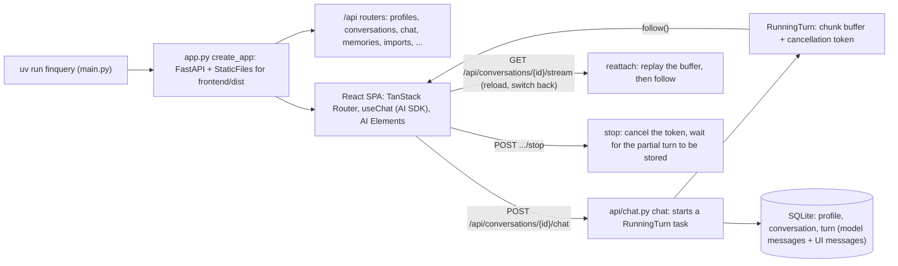

# 01: Runnable with uv, the UI, the chat, and conversations that start, stop and resume

**Claim:** `uv run finquery` starts one Python process that serves the API and the built web UI
at `http://127.0.0.1:8000`. The chat takes text (and files), shows the whole history, streams
thinking and answers, and a turn is a task the server owns: Stop ends it and keeps the partial
turn, a reload or a switch of conversation reattaches to the same stream, and conversations are
created, continued, renamed and deleted per profile from the sidebar and the tabs.

This chapter covers five bullets of the course sheet (`docs/course/task-description.md`):
runnable with `uv`; a user interface; a chat interface with visible, scrollable history; start,
stop and resume with switching; create, continue and remove conversations.

## How it works

In words:

1. `uv run finquery` reads `.env`, builds the app and runs uvicorn. The same process serves the
   REST API under `/api` and the built Vite bundle from `frontend/dist`. Node is needed only to
   build the frontend on a development machine. The app runs on macOS, Linux and Windows
   wherever Python 3.12 and a browser are.
2. The UI is a React single-page app: a sidebar with the profile switcher and the conversation
   list, tabs for open conversations, the transcript (AI Elements components), the composer with
   attachments, a model picker, and pages for Dashboard, Transactions, Imports, Memory, Feedback,
   Settings and Onboarding.
3. A message is posted to the chat endpoint. The server appends only the newest client message
   to its own persisted history, opens a turn row before the model is called, assembles the
   prompt, and starts the run as an asyncio task the app owns. The HTTP response is one
   subscriber to that task's chunk buffer.
4. The stream is the Vercel AI SDK UI message protocol: reasoning parts, text parts, tool parts,
   custom data parts. The browser renders it with `useChat`. Every turn is stored twice, as
   Pydantic AI messages (what the model sees) and as UI messages (what the transcript renders),
   so a reload draws exactly what the stream drew.
5. Stop is a dedicated endpoint that cancels the token; the partial thinking, tool steps and text
   are kept and the turn is marked interrupted. A reload, a closed tab or a switch to another
   conversation does not stop anything: `useChat`'s resume asks `GET .../stream`, which replays
   the buffer from its first chunk and follows live, or answers 204 when nothing runs.
6. Conversations are created with one click, continued by opening and sending, renamed inline,
   deleted with a confirmation; they belong to exactly one profile, and profiles are created,
   renamed, switched and deleted from the sidebar.

## The code path

1. `src/finquery/main.py:main`: the `finquery` console script (`pyproject.toml`
   `[project.scripts]`), `--dev` for API-only with reload; `dev_app`.
2. `src/finquery/app.py:create_app`: the FastAPI app, the lifespan (default profile, an empty
   `running_turns` registry, `close_open_turns` for turns a dead process left), every router
   under `/api`, `StaticFiles` for `frontend/dist` with the CORS header the chart frame needs,
   `resolve_model` and `web_client` overrides for tests.
3. `src/finquery/api/profiles.py:list_profiles`, `add_profile`, `rename_profile`,
   `delete_profile` (the last profile cannot be deleted; a profile takes its conversations with
   it).
4. `src/finquery/api/conversations.py:list_conversations` (by last activity, with `running`),
   `create_conversation`, `get_conversation` (the full transcript, the summary, ratings),
   `patch_conversation` (title, slot, summary), `delete_conversation`.
5. `src/finquery/api/chat.py:chat`: the turn. `open_turn` before the model, `_prompt_for` (the
   assembly), `RunningTurn` in `state.running_turns`, `persist_partial` every tool boundary and
   at most every 3 s of text, `persist_turn` at the end, `reattach` (`GET .../stream`), `stop`.
6. `src/finquery/api/running.py:RunningTurn` (`push`, `follow`, `close`), `stream_response`,
   `partial_parts`.
7. `src/finquery/db.py:Profile`, `Conversation`, `Turn` (`model_messages_json`,
   `ui_messages_json`, `model_slot`, `interrupted`, `finished`).
8. `frontend/src/routes.tsx:router`: `/`, `/c/$conversationId`, `/dashboard`, `/import`,
   `/transactions`, `/memory`, `/feedback`, `/settings`, `/onboarding`.
9. `frontend/src/components/chat-view.tsx:ChatView`: `useChat` with `DefaultChatTransport`,
   `prepareSendMessagesRequest` (only the newest message), `prepareReconnectToStreamRequest`
   (the stream URL), `resume` when the conversation is running and this view did not start it;
   `foldReasoning`, `stoppedTool`, `InterruptedTurn`.
10. `frontend/src/components/app-sidebar.tsx:AppSidebar`,
    `frontend/src/components/conversation-tabs.tsx:ConversationTabs`,
    `frontend/src/components/profile-switcher.tsx:ProfileSwitcher`,
    `frontend/src/lib/workspace.tsx:WorkspaceProvider` (active profile, open tabs, per
    conversation draft and scroll position in local storage).
11. `frontend/src/components/composer.tsx:Composer`: text, attachments, Enter sends, the Stop
    button while a turn runs.
12. `frontend/src/lib/transcript-markdown.ts:messageToMarkdown`: the conversation download,
    tool steps, cards and figures included.

## Where the model is in the loop, and where it is not

- Model: the answer of a turn (chat slot), the follow-up suggestions and the memory distillation
  after it (fast slot), the rolling summary when a conversation crosses 60 percent (fast slot).
- Not the model: serving, routing, the stream protocol, persistence, Stop, reattach, the running
  flag, titles from the first message, tabs, drafts, scroll positions, the onboarding welcome
  turn (seeded by the server), the sample year import.

## Guards and failure handling

- The turn row exists before the model is asked (`open_turn`), so a reload, a restart or a
  crash never loses the question; `close_open_turns` marks what a dead process left as
  interrupted (ticket 32).
- A second POST while a conversation is running is 409 with one sentence (`ALREADY_RUNNING`),
  and the composer is closed in every tab while a chat answers.
- An empty or whitespace message is 422, no model call.
- A framework exception inside a run reaches the transcript as one sentence (`TURN_FAILED`); the
  detail goes to the log; the question is kept.
- Chat template tokens and retry prompts are filtered from text and thinking on the way out and
  on the way into the database (`TextFilter`, `ThinkingFilter`, `_renderable`).
- The post-turn pair (follow-ups, distillation) runs under a 30 s timeout and can never cost the
  answer.
- Every test drives the FastAPI app over HTTP with both slots replaced by a scripted
  `FunctionModel` (ADR 0003): `tests/conftest.py`.

## What we measured

| Figure | Value | Source |
| --- | --- | --- |
| Clean checkout | `uv sync` 0.2 s (cached wheels), `npm install` 2 s, `npm run build` 0.6 s, server up, all four model files ready from a parked copy within seconds | ticket 17 |
| A browser that hangs up four seconds into a turn, before ticket 33 | nothing left behind, not even the question | ADR 0012, ticket 33 |
| After ticket 33 | the run finishes with nobody attached; a reload mid-turn shows one message, not two; `kill -9` mid-turn keeps the query step and five months of a table | ticket 33 |
| Stop | under a second after the click; the partial turn stays with a Stopped chip | `docs/demo-script.md`, ticket 33 |
| Switch chat mid-turn and come back, reload mid-turn | instant, the turn is untouched | `docs/demo-script.md` |
| Thirty open tabs, back and forward, deleting a conversation open in another tab | verified in the browser | ticket 32 |
| Tests | `tests/test_background_turns.py` (8), `tests/test_conversations.py`, `tests/test_profiles.py`, `tests/test_chat.py` | tickets 01, 02, 32, 33 |

## Three sentences for the talk

1. "One `uv run finquery` starts one process that serves the API and the web app; the models
   download on first run with progress in Settings, and a parked copy is linked in if its hash
   matches."
2. "A turn is a task the server owns, not the request that asked for it: you can switch chats,
   reload or close the tab and come back to the same stream from its first chunk, and Stop is
   the only thing that ends a turn early."
3. "Every turn is stored as what the model saw and as what you saw, so the transcript after a
   reload is the transcript you watched, thinking and tool steps included."

## Likely grader questions

- **Is a browser UI allowed?** The sheet accepts any framework that runs on Windows, macOS and
  Linux, graphical or textual. A React app served by the Python process runs wherever a browser
  does; there is no Node at runtime.
- **What does "resume" mean here?** Two things: continuing an old conversation by opening it and
  sending (the server owns the history), and reattaching to a running turn after a reload or a
  switch (`GET .../stream`).
- **What happens if the process dies mid-turn?** The next start marks the open turn interrupted
  and the transcript keeps what had been written so far (progressive `persist_partial`).
- **Why does `useChat` send only the newest message?** The server owns the history, and the
  endpoint trims to the last message anyway (ADR 0001).
- **Where are the pages other than chat?** Dashboard (11), Transactions (10), Imports (08),
  Memory (03), Feedback (14), Settings and Onboarding.

## What is not finished

- The video demo is not made (05).
- The hand-in ZIP packaging (a C compiler is needed for `llama-cpp-python`; the old repo noted
  shipping wheels as the mitigation) follows the demo.
- Only one user per installation: concurrent multi-user is not claimed; profiles are isolation,
  not authentication.
