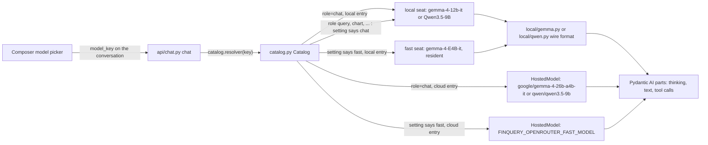

# 02: Four models to choose from, two of them resident on the laptop

**Claim:** The picker offers four chat models across both providers, two of them running on the
laptop through llama-cpp-python in this Python process with thinking, tool calls and vision;
the user switches per conversation, and nothing above the catalog module knows which model or
which provider answered.

## How it works

In words:

1. A conversation stores a catalog key, never a position: `local:gemma-4-12b`,
   `openrouter:google/gemma-4-26b-a4b-it`, `local:qwen3.5-9b` or `openrouter:qwen/qwen3.5-9b`.
   The composer changes it with `PATCH /api/conversations/{id}` and the next turn uses it.
2. The chat endpoint asks the catalog for a resolver bound to that entry and hands it to the
   turn. `resolver("chat")` is the entry itself; a sub-agent asks for its own role
   (`"query"`, `"chart"`, `"extraction"`, ...) and gets what that role's setting names: the
   chat entry by default, the fast slot of the entry's provider, or a pinned catalog key.
3. Both providers are live at the same time. `FINQUERY_PROVIDER` decides one thing: which entry
   a new conversation starts on. A cloud entry with no `OPENROUTER_API_KEY` and a local entry
   with no weights are both listed, disabled, with the reason.
4. Locally every request goes through llama-cpp-python's chat handler with the GGUF's own chat
   template, on one worker thread per seat. The raw token stream comes back as text, and a wire
   format module per model splits it into thinking parts, text parts and tool calls.
5. One local model is loaded at a time, Gemma 4 12B by default (ticket 68): choosing another
   entry drains the loaded one, unloads it and loads the new one at the same context. A seat is
   which model the `fast` role means, not a second place in memory.
6. Everything above (the agent, the tools, the API, the UI) sees Pydantic AI parts and knows
   nothing about the provider. Every name on screen comes from `GET /api/models`.

## The code path

1. `src/finquery/settings.py:Settings`: `provider`, `local_n_ctx` (32768), `models_dir`,
   `parked_models_dir`, `openrouter_fast_model` (the hosted sub-agent slot) and the seven
   `subagent_model_*` role settings. The two hosted chat entries are constants of the catalog
   (`src/finquery/catalog.py:HOSTED_CHAT_MODELS`), so both stay listed when the fast slot points
   at one of them.
2. `src/finquery/catalog.py:Catalog`: the four entries, their availability with a reason, and
   `resolver(key)`, which returns the `role -> Model` callable a turn hands to its tools.
   Construction never touches the network or loads weights.
3. `src/finquery/providers.py:HostedModel`: the OpenRouter wrapper. It falls back to low
   reasoning effort when a hosted model refuses reasoning off.
4. `src/finquery/providers.py:subagent_settings` and `SUBAGENT_MAX_TOKENS`: reasoning off and a
   3072 token output ceiling for every sub-agent call, on any model it resolved to.
5. `src/finquery/local/catalog.py:LOCAL_MODELS`: the three `ModelSpec` entries with repo, file
   name, size and sha256 for weights and projector, which seat each takes and which wire format
   each speaks.
6. `src/finquery/local/downloads.py:DownloadManager`: downloads with per-file progress, or
   links in a parked copy whose sha256 matches.
7. `src/finquery/local/runtime.py:LocalStack`: `resolve` (a `LlamaCppModel` for one model, 503
   if the files are missing), `slot` (load on first use), `take_seat` (drain, unload, load, in
   that order), `holding` (one lock, re-entrant inside one asyncio task, and where the swap
   happens), `with_adapter` (attach a LoRA adapter on a run on E4B), `drain` (wait for a
   cancelled call to leave llama.cpp). One model is loaded at a time since ticket 68.
8. `src/finquery/local/model.py:LlamaCppModel`: the Pydantic AI `Model`. `request_stream`
   renders messages to the OpenAI-shaped dicts the template expects, decides `enable_thinking`
   (on for a free request, off when a single tool is forced), sets the model's sampling from
   the wire format, and streams tokens through the splitter.
9. `src/finquery/local/wire.py:WireFormat` is the shape; `src/finquery/local/gemma.py:StreamSplitter`
   and `src/finquery/local/qwen.py:StreamSplitter` are the two implementations. Each holds back
   a delta that could still be the start of a marker.
10. `src/finquery/local/adapters.py:AdapterRegistry`: `attached_to` attaches
    `models/adapters/{query,chart}.gguf` under a lock, or yields an audit note when the file is
    missing and the run continues on the base weights.
11. `src/finquery/local/check.py:check_slot`: the `finquery-check` command. Answer, thinking,
    tool call and vision on every local model whose weights are on disk, one at a time and each
    in place of the last, plus the adapter files' presence. It prints no memory figure: RSS is
    not to be trusted for an mmapped 13 GB GGUF (ticket 68).
12. `src/finquery/api/chat.py:chat` reads the conversation's entry and stamps `model_key` on
    every assistant message; `src/finquery/api/chat.py:stop` cancels the token, and the local
    loop checks it between tokens.
13. `src/finquery/api/models.py:get_models` returns the catalog with availability and download
    progress; `frontend/src/lib/catalog.ts:useCatalog` reads it and
    `frontend/src/components/model-picker.tsx:ModelPicker` shows it.

## Where the model is in the loop, and where it is not

- The model is in the loop for the chat turn itself, and for every sub-agent call, which runs
  on the model that sub-agent's role is set to.
- The model is not in the loop for: which model runs (the conversation's entry, chosen by the
  user), which model each sub-agent role uses (a setting, and its provider is always the
  entry's), how a turn is split into
  thinking, text and tool calls (our splitter, from the template's markers), whether thinking
  is on (a template argument decided by whether a tool is forced), the output ceiling, the
  adapter attach and detach, cancellation, the labels in the UI.

## Guards and failure handling

- Schema-constrained output and free tool calling are never in one request. A sub-agent has
  exactly one tool and no text output, which makes llama.cpp build a GBNF grammar from its
  parameters and turns thinking off. Every other request declares tools with `tool_choice: auto`.
- `SUBAGENT_MAX_TOKENS = 3072` stops a grammar over a list from repeating rows until the context
  is full (ticket 11 measured six minutes and a prompt past `n_ctx` before it existed).
- A missing adapter file is a supported state: base weights plus an audit note on the turn
  (`tests/test_local_provider.py`, `test_adapter_falls_back_to_base_weights_with_a_note`).
- A missing model file is a 503 with a sentence that says to open Settings; the app starts
  without any weights on disk.
- llama.cpp is not reentrant, so one worker thread, one lock, and `drain` after a cancelled
  turn so the next turn never enters llama.cpp while the old call is inside. A swap drains
  first for the same reason, before the weights the old call was reading are freed, and only
  then loads the model that was asked for.
- A cloud entry with no API key and a local entry with no weights both answer with one sentence
  (a 503 the composer shows), never a stack trace, and the picker disables them with it.
- Template tokens that leak as text (`<turn|>`, a bare `thought` line) are stripped in
  `src/finquery/api/chat.py:TextFilter` and `src/finquery/local/gemma.py:strip_markers`, live
  and on the way into the database.
- Chat template quirks handled in code: Gemma keeps the reasoning of a tool call under
  `reasoning`, Qwen under `reasoning_content`; Qwen writes one tag per tool parameter (the
  `qwen3_coder` style), not JSON; a Qwen parameter body stays text unless it opens a JSON
  object or array (ADR 0006).

## What we measured

| Figure | Value | Source |
| --- | --- | --- |
| The shipped pair on the cluster benchmark | Gemma 4 12B 87 % on SQL and 81 % on charts, against E4B 66 / 45 and Qwen3.5 9B 70 / 42 | `bench/results/20260906-cluster-compare.md`, ticket 56 |
| The shipped pair resident together | about 12.9 GB (E4B plus Gemma 4 12B) against 13.5 GB for E4B plus Qwen, of an 18.2 GB Metal working set | `bench/results/20260906-local-tokens-per-second.md`, ticket 61 |
| What the pair costs in speed | 22.4 tok/s generation and 205 tok/s prompt processing, against 29.5 and 329 with Qwen | `bench/results/20260906-local-tokens-per-second.md` |
| Both models resident at 32k, q8_0 KV, flash attention (Qwen pair) | 13.5 GB (E4B 7.1 GB, Qwen 6.4 GB) | `docs/adr/0006-local-gemma-4-through-llama-cpp.md`, ticket 23 |
| Gemma 4 12B and E4B in one process at 32k, before the q8_0 KV cache | 19.2 GB, out of memory; 16k fit at 16.0 GB | ADR 0006 table, ticket 16 |
| Download size, four GGUF files | 12.6 GB | `README.md`, ticket 23 |
| `finquery-check`, fast slot | load 0.7 s; answer 4.7 s at 32 tok/s; tool call 2.3 s; vision 2.9 s | ticket 23 |
| `finquery-check`, quality slot | load 2.2 s; answer 97 s at 29 tok/s (8426 characters of thinking); tool call 6.0 s; vision 4.0 s | ticket 23 |
| Clean checkout rerun | E4B 4.6 s at 32.6 tok/s; Qwen 88 s at 31.6 tok/s; all eight checks pass | ticket 17 |
| A fast turn with one query, local | 63 s, 72 s, 73 s (three demo questions) | `docs/demo-script.md` table |
| The prepared Qwen question, local | 138 s, about 12 s visible thinking, 1 s load | `docs/demo-script.md` |
| Stop | under a second after the click | `docs/demo-script.md` |
| Reasoning off on sub-agents (OpenRouter) | follow-up step 11 s to 3 s | ticket 02 |

## Three sentences for the talk

1. "The picker offers four models: Gemma 4 12B and Qwen3.5 9B on this laptop, and Gemma 4 26B
   and Qwen3.5 9B in the cloud. Two are resident here, about 13 gigabytes together, and the two
   local chat models share one seat because three do not fit."
2. "Whatever the chat runs on, its sub-agents run on the same provider, so a local conversation
   never sends anything anywhere; which model each sub-agent role uses is one setting, and the
   default is the model the user picked, because the benchmark scores that path."
3. "There is no OpenAI-compatible server in between: llama-cpp-python runs in-process behind a
   Pydantic AI model class we wrote, and because Gemma 4 and Qwen3.5 agree on nothing about how a
   turn looks, each has its own wire format module that turns the raw stream into thinking, text
   and tool calls."
4. "Which entry a new chat starts on is one environment variable and nothing else moves, which
   is also why every test runs against scripted models and none loads a real one."

## Likely grader questions

- **Why is Gemma 4 12B the default and not Qwen3.5 9B?** The cluster benchmark of 2026-09-06:
  87 percent figure match on the SQL set against Qwen's 70 and E4B's 66, and 81 percent on the
  chart set against 42 and 45. Qwen was the default before that, chosen on memory (its hybrid
  attention makes 32k cheap) rather than on measured accuracy. The pair costs no more memory
  (12.9 GB against 13.5) and about a third of the speed, which the demo script budgets for.
  Qwen3.5 9B is still one click away in the picker (ADR 0006, ticket 61).
- **Why is Gemma 4 26B the hosted third entry and not Gemma 4 12B?** OpenRouter does not serve a
  Gemma 4 12B, and 26B A4B is the nearest Gemma 4 there is. The id is a setting, so a served 12B
  would be a one line change (ADR 0013).
- **Can a local and a hosted model run at the same time?** Yes. Both providers are live;
  `FINQUERY_PROVIDER` only picks which entry a new chat starts on. Two chats can ask the same
  question of the local Qwen and the hosted Qwen side by side.
- **Is llama-cpp-python an agent framework that implements an elective?** No. It runs the
  weights. Pydantic AI carries the stream and dispatches tools. Sub-agents, compression, memory,
  and the web loop are our code (ADR 0001, `.scratch/finquery/spec.md`).
- **Where are the two fine-tuned models?** Two LoRA adapters over the same E4B base, one for the
  query sub-agent and one for the chart sub-agent. The attach path, the registry, the audit note
  and the bench `--adapter` flag exist; the adapters themselves are not trained yet. See 04.
- **Why does thinking turn off for a sub-agent?** A grammar-constrained answer has no room for a
  thought channel, and the sub-agent's thinking is never shown anyway. Each forced tool has a
  `reasoning` field filled first instead (ticket 42).
- **Why is a local turn a minute?** Mostly prompt evaluation: llama.cpp's multimodal handler
  re-reads the whole prompt on every request and a turn is four to six requests. There is no
  prefix cache on this path (ticket 23, `docs/demo-script.md`).
- **Does Stop really stop the model?** The cancellation token is checked between tokens, so the
  loop ends within one token, and the slot is drained before the next turn takes it.

## What is not finished

- No adapter file exists yet, so `with_adapter` always yields the audit note path in practice.
  Training is ticket 43 plus the DPO loop (04).
- No prompt prefix caching on the local provider; a late turn in a long conversation can wait
  20 seconds before its first token.
- Vision runs on both seats (the sanity check reads a red square), and the only production
  vision caller is the extraction role, on whichever model that role is set to.
