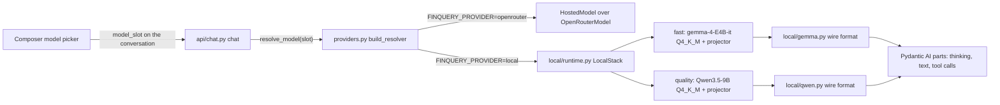

# 02: Two resident local models, one switch

**Claim:** The whole app runs on two models on the laptop through llama-cpp-python, in one
Python process, with thinking, tool calls and vision on both; the user switches between them
per conversation; nothing above the provider module knows which model or which provider is
running.

## How it works

In words:

1. A conversation stores a slot, `fast` or `quality`, never a model name. The composer changes
   it with `PATCH /api/conversations/{id}` and the next turn uses it.
2. The chat endpoint asks `resolve_model(slot)` for a Pydantic AI `Model`. That callable was
   built once at startup from `FINQUERY_PROVIDER`.
3. On `openrouter` the two slots are `google/gemma-4-26b-a4b-it` and `qwen/qwen3.5-9b` with
   reasoning enabled. On `local` they are the two GGUF files in the catalog, loaded on first use
   and kept resident.
4. Locally every request goes through llama-cpp-python's chat handler with the GGUF's own chat
   template, on one worker thread per slot. The raw token stream comes back as text, and a wire
   format module per model splits it into thinking parts, text parts and tool calls.
5. Everything above (the agent, the tools, the API, the UI) sees Pydantic AI parts and knows
   nothing about the provider. The model picker labels the slot with the name the running
   provider really resolved it to (`GET /api/models`).

## The code path

1. `src/finquery/settings.py:Settings`: `provider`, `local_n_ctx` (32768), `models_dir`,
   `parked_models_dir`, `openrouter_fast_model`, `openrouter_quality_model`.
2. `src/finquery/providers.py:build_resolver`: returns a `slot -> Model` callable. Construction
   never touches the network or loads weights.
3. `src/finquery/providers.py:HostedModel`: the OpenRouter wrapper. It falls back to low
   reasoning effort when a hosted model refuses reasoning off.
4. `src/finquery/providers.py:subagent_settings` and `SUBAGENT_MAX_TOKENS`: reasoning off on
   OpenRouter, a 3072 token output ceiling on both providers, for every sub-agent call.
5. `src/finquery/local/catalog.py:LOCAL_MODELS`: the two `ModelSpec` entries with repo, file
   name, size and sha256 for weights and projector, and which wire format each speaks.
6. `src/finquery/local/downloads.py:DownloadManager`: downloads with per-file progress, or
   links in a parked copy whose sha256 matches.
7. `src/finquery/local/runtime.py:LocalStack`: `resolve` (a `LlamaCppModel` for a slot, 503 if
   the files are missing), `slot` (load on first use, then resident), `holding` (one lock per
   slot, re-entrant inside one asyncio task), `with_adapter` (attach a LoRA adapter on the
   fast slot for one run), `drain` (wait for a cancelled call to leave llama.cpp).
8. `src/finquery/local/model.py:LlamaCppModel`: the Pydantic AI `Model`. `request_stream`
   renders messages to the OpenAI-shaped dicts the template expects, decides `enable_thinking`
   (on for a free request, off when a single tool is forced), sets the model's sampling from
   the wire format, and streams tokens through the splitter.
9. `src/finquery/local/wire.py:WireFormat` is the shape; `src/finquery/local/gemma.py:StreamSplitter`
   and `src/finquery/local/qwen.py:StreamSplitter` are the two implementations. Each holds back
   a delta that could still be the start of a marker.
10. `src/finquery/local/adapters.py:AdapterRegistry`: `attached_to` attaches
    `models/adapters/{query,chart}.gguf` under a lock, or yields an audit note when the file is
    missing and the run continues on the base weights.
11. `src/finquery/local/check.py:check_slot`: the `finquery-check` command. Answer, thinking,
    tool call and vision on each slot, plus the adapter files' presence.
12. `src/finquery/api/chat.py:chat` resolves the slot and stamps `model_slot` on every assistant
    message; `src/finquery/api/chat.py:stop` cancels the token, and the local loop checks it
    between tokens.
13. `src/finquery/api/models.py:get_models` carries a label per slot;
    `frontend/src/lib/slots.ts:useSlotLabel` reads it and
    `frontend/src/components/model-picker.tsx:ModelPicker` shows it.

## Where the model is in the loop, and where it is not

- The model is in the loop for the chat turn itself, and for every sub-agent call on the fast
  slot.
- The model is not in the loop for: which model runs (a setting), how a turn is split into
  thinking, text and tool calls (our splitter, from the template's markers), whether thinking
  is on (a template argument decided by whether a tool is forced), the output ceiling, the
  adapter attach and detach, cancellation, the labels in the UI.

## Guards and failure handling

- Schema-constrained output and free tool calling are never in one request. A sub-agent has
  exactly one tool and no text output, which makes llama.cpp build a GBNF grammar from its
  parameters and turns thinking off. Every other request declares tools with `tool_choice: auto`.
- `SUBAGENT_MAX_TOKENS = 3072` stops a grammar over a list from repeating rows until the context
  is full (ticket 11 measured six minutes and a prompt past `n_ctx` before it existed).
- A missing adapter file is a supported state: base weights plus an audit note on the turn
  (`tests/test_local_provider.py`, `test_adapter_falls_back_to_base_weights_with_a_note`).
- A missing model file is a 503 with a sentence that says to open Settings; the app starts
  without any weights on disk.
- llama.cpp is not reentrant, so one worker thread per slot, one lock per slot, and `drain`
  after a cancelled turn so the next turn never enters llama.cpp while the old call is inside.
- Template tokens that leak as text (`<turn|>`, a bare `thought` line) are stripped in
  `src/finquery/api/chat.py:TextFilter` and `src/finquery/local/gemma.py:strip_markers`, live
  and on the way into the database.
- Chat template quirks handled in code: Gemma keeps the reasoning of a tool call under
  `reasoning`, Qwen under `reasoning_content`; Qwen writes one tag per tool parameter (the
  `qwen3_coder` style), not JSON; a Qwen parameter body stays text unless it opens a JSON
  object or array (ADR 0006).

## What we measured

| Figure | Value | Source |
| --- | --- | --- |
| Both models resident at 32k, q8_0 KV, flash attention | 13.5 GB (E4B 7.1 GB, Qwen 6.4 GB) of an 18.2 GB Metal working set on a 24 GB M4 Pro | `docs/adr/0006-local-gemma-4-through-llama-cpp.md`, ticket 23 |
| Same with Gemma 4 12B as quality at 32k | 19.2 GB, out of memory; 16k fit at 16.0 GB | ADR 0006 table, ticket 16 |
| Download size, four GGUF files | 12.6 GB | `README.md`, ticket 23 |
| `finquery-check`, fast slot | load 0.7 s; answer 4.7 s at 32 tok/s; tool call 2.3 s; vision 2.9 s | ticket 23 |
| `finquery-check`, quality slot | load 2.2 s; answer 97 s at 29 tok/s (8426 characters of thinking); tool call 6.0 s; vision 4.0 s | ticket 23 |
| Clean checkout rerun | E4B 4.6 s at 32.6 tok/s; Qwen 88 s at 31.6 tok/s; all eight checks pass | ticket 17 |
| A fast turn with one query, local | 63 s, 72 s, 73 s (three demo questions) | `docs/demo-script.md` table |
| The prepared Qwen question, local | 138 s, about 12 s visible thinking, 1 s load | `docs/demo-script.md` |
| Stop | under a second after the click | `docs/demo-script.md` |
| Reasoning off on sub-agents (OpenRouter) | follow-up step 11 s to 3 s | ticket 02 |

## Three sentences for the talk

1. "Two models are resident on this laptop at the same time, 13.5 gigabytes together, and the
   switch in the composer picks which one answers; every sub-agent always runs on the small one."
2. "There is no OpenAI-compatible server in between: llama-cpp-python runs in-process behind a
   Pydantic AI model class we wrote, and because Gemma 4 and Qwen3.5 agree on nothing about how a
   turn looks, each has its own wire format module that turns the raw stream into thinking, text
   and tool calls."
3. "Switching to OpenRouter for development is one environment variable and nothing else moves,
   which is also why every test runs against scripted models and none loads a real one."

## Likely grader questions

- **Why Qwen3.5 9B and not Gemma 4 12B for the quality slot?** Both models at 32k did not fit
  in 24 GB with the 12B. Qwen's hybrid attention (only every fourth layer is full attention)
  makes doubling its context cost 0.27 GB against 3.5 GB for the 12B, and it is better at tool
  calling over numbers (ticket 23, ADR 0006).
- **Is llama-cpp-python an agent framework that implements an elective?** No. It runs the
  weights. Pydantic AI carries the stream and dispatches tools. Sub-agents, compression, memory,
  preferences and the web loop are our code (ADR 0001, `.scratch/finquery/spec.md`).
- **Where are the two fine-tuned models?** Two LoRA adapters over the same E4B base, one for the
  query sub-agent and one for the chart sub-agent. The attach path, the registry, the audit note
  and the bench `--adapter` flag exist; the adapters themselves are not trained yet. See 04.
- **Why does thinking turn off for a sub-agent?** A grammar-constrained answer has no room for a
  thought channel, and the sub-agent's thinking is never shown anyway. Each forced tool has a
  `reasoning` field filled first instead (ticket 42).
- **Why is a local turn a minute?** Mostly prompt evaluation: llama.cpp's multimodal handler
  re-reads the whole prompt on every request and a turn is four to six requests. There is no
  prefix cache on this path (ticket 23, `docs/demo-script.md`).
- **Does Stop really stop the model?** The cancellation token is checked between tokens, so the
  loop ends within one token, and the slot is drained before the next turn takes it.

## What is not finished

- No adapter file exists yet, so `with_adapter` always yields the audit note path in practice.
  Training is ticket 43 plus the DPO loop (04).
- No prompt prefix caching on the local provider; a late turn in a long conversation can wait
  20 seconds before its first token.
- Vision runs on both slots (the sanity check reads a red square), but the only production
  vision caller is the extraction sub-agent on the fast slot.
