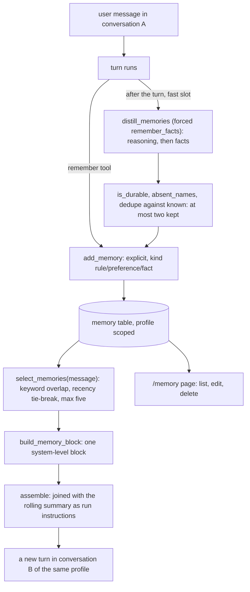

# 03: Memory across the chats of a profile

**Claim:** A profile is the group of chats (the sheet's "Project Folder"). Facts established in
one conversation are known in every other conversation of the profile: stored explicitly through
a `remember` tool, or distilled by a fast-slot pass after each turn with strict rules on what is
durable, listed on a Memory page with edit and delete, and selected into a new turn's prompt by
keyword overlap and recency, at most five at a time.

## How it works

In words:

1. Two ways in. The user says "Remember: my flatmate is Max Schulz" and the chat agent calls
   `remember`, which writes one memory at once and confirms in one line. After every turn a
   distillation pass on the fast slot reads the question and the answer and returns candidate
   facts through one forced tool, with a `reasoning` line per candidate saying whether it is
   still true next month.
2. Code judges the candidates: a fact carrying an amount or a date is not durable unless it is a
   rule; a fact naming something this turn's queries proved absent is refused; a fact the profile
   already knows word for word is refused; at most two per turn survive. A pass whose every fact
   was refused is handed the refusals once and told an empty list is the usual answer.
3. Every memory belongs to one profile and carries the conversation it came from. The Memory
   page lists them newest first with inline edit and delete.
4. When any conversation of the profile starts a turn, the memories are ranked by keyword
   overlap with the new message, recency breaking ties, capped at five, and rendered as one block
   that travels as run instructions above the conversation, next to the rolling summary. The
   block says a memory's language decides nothing about this answer's language.
5. The count rides in the `data-context` part, so the answer shows "N memories used" and the
   context badge shows the same number after a reload.

## The code path

1. `src/finquery/memory.py:add_memory` (refuses a normalized duplicate), `list_memories`,
   `select_memories` (`MAX_MEMORIES = 5`), `build_memory_block` (`MemoryBlock` with `text` and
   `used`), `keywords`, `normalize`.
2. `src/finquery/memory.py:distill_memories` (forced `remember_facts` returning
   `DistilledFacts`, `retries={"output": 0}`, one second pass with `refusal_prompt`),
   `is_durable`, `absent_names`, `worth_keeping`, `MAX_DISTILLED = 2`, `DISTILL_INSTRUCTIONS`
   (three worked exchanges, twice "store nothing").
3. `src/finquery/agent.py:remember`: the explicit tool, `kind` rule, preference or fact.
4. `src/finquery/api/chat.py:chat` builds the block from the newest user message (or the message
   that opened a resumed card turn) and hands it to `_prompt_for`; `_found_nothing` feeds the
   absent names to `_distill` after the turn.
5. `src/finquery/context.py:assemble`: joins the summary note and the memory text into one
   instructions string and counts both toward the badge.
6. `src/finquery/db.py:Memory`: `profile_id`, `text`, `kind`, `source` (explicit or distilled),
   `created_from`.
7. `src/finquery/api/memories.py:get_memories`, `patch_memory`, `delete_memory` (no POST:
   memories are created by the assistant).
8. `frontend/src/components/memory-page.tsx:MemoryPage`; the "N memories used" chip in
   `frontend/src/components/chat-view.tsx:ChatView`;
   `frontend/src/components/context-badge.tsx:ContextBadge`.
9. `tests/test_memory.py`: a fact from one conversation reaches a new one and stays in its
   profile; a deleted memory is not sent again; at most five travel; two hundred memories still
   send five; an edited memory is what the next turn receives.

## Where the model is in the loop, and where it is not

- Model: deciding to call `remember` and what to store; proposing distilled facts; using a
  memory when it applies (for example writing the remembered name into a query request).
- Not the model: whether a candidate is durable, the dedupe, the cap of two per turn and five
  per prompt, the selection, the profile boundary, the page, the language rule in the block.

## Guards and failure handling

- Distillation can never fail a turn: any exception is logged and the answer stands (ticket 32).
- A memory of another profile is never selected: `list_memories` is profile scoped, and
  `ChatDeps.profile_id` comes from the conversation row.
- A fact about a person the same turn proved absent is refused (`absent_names`), because the
  review of 2026-09-05 saw an invented memory about Max Schulz read back forever.
- Dedupe is a normalized text match: a paraphrase lands twice; the Memory page is the escape
  hatch and embeddings the noted upgrade path (`memory.py`).
- A fact is written in the language of the turn it came from, never translated (ticket 22), and
  the block tells the model that says nothing about this turn's language.
- Memories are never data: the block says numbers still come only from executed queries.

## What we measured

| Figure | Value | Source |
| --- | --- | --- |
| Memory across conversations, local demo | "Remember: my flatmate is Max Schulz." 49 s to 84 s; a new chat answers "137,50 EUR to your flatmate, Max Schulz" in 59 s with "5 memories used" | `docs/demo-script.md`, ticket 17 |
| Before the ticket 37 rules | 27 memories in one afternoon, one about a person the data did not have | ticket 37 (Qwen review) |
| After | 3 memories after 13 turns, none with a figure or a date, none about Max Schulz | ticket 37 |
| Cap | a profile with 200 memories sends five and lists all 200 | ticket 32, `tests/test_memory.py` |
| Wording matters | a short stored fact carried the word "flatmate" and the next question hit; a longer sentence was stored without it and missed | ticket 17 |
| Distillation on OpenRouter | the hosted fast model answered the distillation prompt in prose on every turn of one session (logged, swallowed, no memories stored that day) | ticket 33 |

## Three sentences for the talk

1. "A profile is the folder: anything you tell the assistant in one chat, or anything it
   distills after a turn, is known in every other chat of that profile, and only there."
2. "Distillation is strict on purpose: a small model wants to remember every figure, so code
   refuses a fact with an amount or a date unless it is a rule, refuses a fact about something the
   turn proved absent, and keeps at most two per turn."
3. "A new turn gets at most five memories, chosen by keyword overlap with your message, rendered
   as one block above the conversation, and the answer shows how many were used."

## Likely grader questions

- **How is this different from the rolling summary?** The summary is per conversation and
  replaces old turns; memories are per profile and cross conversations. Both travel as the same
  system-level instructions block (`assemble`), so the badge counts both.
- **Why keyword overlap and not embeddings?** Hundreds of memories per person, five slots, and a
  profile with fewer than five sends all of them. Embeddings are the upgrade path when dedupe of
  paraphrases matters.
- **Can a memory make the model state a number?** The block forbids it and the prose check
  (06) removes a figure no query returned.
- **Can the user see and fix memories?** `/memory` lists every fact with edit and delete, and the
  answer's "N memories used" chip links there.
- **Does the same fact in German and English duplicate?** Yes, both are kept in their own
  language; cross-language dedupe is a new mechanism, not built (ticket 27).

## What is not finished

- Embedding-based dedupe and cross-language matching.
- Selection scores every memory of the profile in Python (fine for hundreds; a full-text index is
  the upgrade, noted in `select_memories`).
- On the hosted fast model the distillation pass often answers in prose instead of its tool and
  stores nothing; locally the forced tool is a grammar and the pass works (ticket 33 note).
