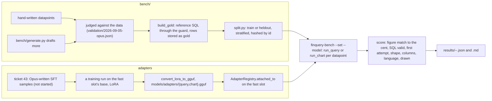

# 04: The two fine-tuned models, and the training and benchmark loop behind them

**Claim:** The sheet requires at least two fine-tuned models (LoRA or QLoRA). Ours are two LoRA
adapters over the same Gemma 4 E4B base, one for the query sub-agent and one for the chart
sub-agent, attached per sub-agent run on the fast slot. **Neither is trained yet.** What exists
is the loop around them: two hand-checked benchmark sets (152 SQL questions, 63 chart requests)
with gold computed by executing reference SQL, a runner that scores any model through the real
sub-agent path with an `--adapter` flag, a static validation page, a held-out third, the adapter
registry with a lock and an audit note.
Ticket 43 (the SFT training data written and judged by Opus sub-agents) has not started.

## How it works

In words:

1. A SQL datapoint is a question (German or English), tags (kind, difficulty), an optional
   conversation prefix, a reference statement we wrote, and the rows that statement returns over
   the shipped synthetic year. A chart datapoint adds the expected shape, acceptable shapes, the
   column roles and the language. Gold is code: `build_gold` runs the reference through the real
   guard and fails if it is refused or returns nothing.
2. Every one of the 108 hand-written datapoints was read against the data by hand (recomputed in
   Python, then the reference SQL through the guard); eight questions were fixed, none dropped.
   190 more were drafted with Gemini 3.8 Flash and judged the same way; 107 were kept.
3. About a third of each set is held out (`split` field), stratified and hashed by id, so a
   later adapter trained on examples from the train half is scored on the held-out half.
4. The runner loads a fresh database with the synthetic year, pins `today` to 2025-12-31, and
   runs the real path (`run_query` with or without the check, `run_chart`) against any model:
   an OpenRouter id, a slot on the current provider, or `local:<slot>` with an optional
   `--adapter`. Every slot the path asks for resolves to the model under test.
5. A LoRA adapter attaches to the fast slot for one run through the low-level llama.cpp API; a
   missing file is a supported state with an audit note. The training prompt is the production
   prompt, because a dataset built from any other phrasing would train a model for a prompt the
   app never sends.

## The code path

1. `bench/finquery_bench/datapoints.py:load_sql`, `load_charts`, `pick`, `review_sample`.
2. `bench/finquery_bench/gold.py:run_reference` (refuses no rows and rows with no figure),
   `build`; `bench/build_gold.py`.
3. `bench/finquery_bench/splits.py:assign`, `write_splits`; `bench/split.py`.
4. `bench/finquery_bench/run.py:run_sql_point`, `run_chart_point`, `run_points`, `summarize`.
5. `bench/finquery_bench/score.py:figure_match` (every gold figure present, not a dump of more
   than three times the rows), `shape_match`, `columns_map`.
6. `bench/finquery_bench/models.py:resolve_target`, `openrouter_target`, `local_target` (sets
   `finquery_adapter` on the model settings when `--adapter` is given).
7. `bench/finquery_bench/cli.py:main`: `finquery-bench` with `--set`, `--model`, `--adapter`,
   `--n`, `--seed`, `--no-check`, and `compare`; `bench/finquery_bench/report.py:table`,
   `compare`.
8. `bench/finquery_bench/dataset.py:fresh_database`, `load_synthetic_year` (rules and dictionary
   only, the model stage switched off, so a gold row never moves).
9. `bench/generate.py` (drafting with a hosted model, kept only after the SQL runs and a judge
   agrees); `bench/validate/index.html` and `bench/validate/validate.js` (labels in localStorage,
   JSON export); `bench/validation/2026-09-05-opus.json` (the verdicts).
10. Adapters: `src/finquery/local/adapters.py:AdapterRegistry` (`attached_to`, `states`),
    `src/finquery/local/catalog.py:adapter_path` (`models/adapters/{query,chart}.gguf`),
    `src/finquery/local/model.py:LocalModelSettings` (`finquery_adapter`),
    `src/finquery/local/runtime.py:LocalStack` (`with_adapter`).
11. Training: no script in the tree. The DPO half was removed with the preference feature on
    2026-09-06 (ticket 59, explainer 14); the data it would have read never arrived. Ticket 43
    writes the SFT samples the first real run will use.

## Where the model is in the loop, and where it is not

- Model: the model under test writes the SQL and the charts; a hosted model drafted half the
  datapoints (then judged); Opus sub-agents are to write and judge the SFT samples of ticket 43.
- Not the model: gold (executed reference SQL), scoring, the split, the validation verdicts
  (a human or a judging pass with the data in hand), the adapter attach, the export.

## Guards and failure handling

- A reference statement the guard refuses or that returns nothing fails the gold build; a
  generated datapoint is kept only after its SQL runs and a judge agrees.
- A datapoint that throws is one score, not a dead run.
- The `split` is written into the files, so a held-out number means the same thing in six
  months.

## What we measured

| Figure | Value | Source |
| --- | --- | --- |
| Sets | 152 SQL (76 hand, 76 generated, 70 German, 50 held out); 63 charts (32 hand, 31 generated, 32 German, 20 held out) | `bench/README.md` |
| Validation | 108 hand-written figures all reproduced to the cent; 8 questions fixed, 0 dropped; 190 drafted, 107 kept, 40 refused, 43 right but surplus | ticket 41, `bench/validation/2026-09-05-opus.json` |
| Baseline, `--set all`, 2026-09-05 | Gemini 3.8 Flash SQL 93 % / charts 92 %; Qwen3.5 9B 57 % / 40 % | `bench/README.md`, `bench/results/20260905T174123Z-google-gemini-3.8-flash-all.md`, `bench/results/20260905T174126Z-qwen-qwen3.5-9b-all.md` |
| New query prompt, no check | Gemini 95 % (100 % held out); Qwen 69 % (64 % held out) | ticket 40, `bench/results/20260905T182106Z-qwen-qwen3.5-9b-nocheck-sql.md` |
| Chart prompt after ticket 42 | Gemini 97 %; Qwen 26 of 63 ran, 46 % to 50 % on those | `bench/results/20260905T183545Z-google-gemini-3.8-flash-chart.md`, `bench/results/20260905T183542Z-qwen-qwen3.5-9b-chart.md` |
| Gemma 4 E4B, local fast slot | SQL 57 %, median 9.2 s, 26 min; charts 48 % figure match, 73 % drawn, median 36 s, 42 min | `bench/results/20260905T181117Z-local-fast-sql.md`, `bench/results/20260905T183745Z-local-fast-chart.md` |
| Hand vs generated, train vs heldout | Gemini 92 / 93 %, 92 / 94 %; Qwen 56 / 49 %, 57 / 43 % | `bench/README.md` |
| Cost of a full run | Gemini 14m 16s, Qwen 15m 30s wall clock; 1,27 USD for both including two aborted starts | `bench/README.md` |
| Old repo's first SQL adapter | beat a base model 2.4x its size on a prompt the product never sent; 55 % against 55 % through the real loop, so the pipeline was deleted on 2026-09-01 | `DECISIONS.md` on `archive/old-main` |
| Tests | 329 test functions in `tests/`; ticket 40 reported 321 passed, 4 environmental skips | `tests/`, ticket 40 |

## Three sentences for the talk

1. "Gold is code, not a model: every benchmark question carries a reference statement we wrote,
   run through the same guard against the same synthetic year, so a figure in the benchmark is
   exact and reproducible like a figure in the app."
2. "The runner scores any model through the real sub-agent path, and about a third of each set is
   held out and written into the files, so once an adapter is trained on the train half we score
   it on the third it never saw."
3. "The two fine-tuned models are two LoRA adapters over the same E4B base, attached per
   sub-agent for one run; the registry, the fallback and the bench flag are built, the training
   data pipeline is ticket 43, and I will say plainly that the adapters are not trained yet."

## Likely grader questions

- **Where are the two fine-tuned models?** Not trained. What exists: the attach path with lock
  and audit note, `--adapter` on the runner, and the held-out split to score them on. Ticket 43 (about 600 query and 300 chart SFT samples written and judged
  by Opus sub-agents against the production prompts) has not started.
- **Why did you throw away the first adapter?** It was trained on a prompt framing the product
  never sent and was worth nothing through the real loop (55 % against 55 %). Now the training
  prompt is the production prompt by construction (`DECISIONS.md`, ticket 43).
- **Why E4B and not Qwen for the adapters?** E4B runs every sub-agent; a comparison on the same
  base weights measures the adapter and nothing else. Qwen is not the slot that writes SQL.
- **Is the generated half easier?** No: Gemini is within a point of itself on both halves, and
  Qwen is seven points worse on the generated one; the held-out third is 43 % against 57 % for
  Qwen, so it is not a soft third either.
- **What happened to the DPO half?** It needed pairs, and a personal-finance app used by one
  person during a build produces a handful: DPO below about 32 pairs mostly measures noise. The
  feature that collected them was removed on 2026-09-06 (explainer 14), and ticket 43 generates
  SFT data with a judge instead of waiting for clicks.

## What is not finished

- Ticket 43 not started; no adapter trained; no `models/adapters/*.gguf` exists. Every
  sub-agent runs on the base weights today, and none of them sets `finquery_adapter` yet; only
  the bench runner's `--adapter` flag does.
- The four check runs (both models, both sets, check on) and the check's latency cost: the
  OpenRouter key hit its total limit (`403 Key limit exceeded`).
- Qwen's chart re-run after ticket 42 is 26 of 63 datapoints.
- The E4B SQL run is on the baseline prompt; it has no second figure with the current prompt.
- The chart labeling page from ticket 43 (a static page like `bench/validate` for chart samples)
  does not exist yet.
