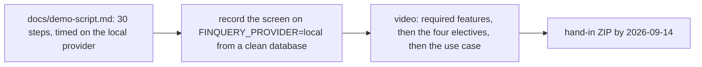

# 05: The video demo

**Claim:** The sheet requires a video that demonstrates the required and elective features that
were implemented and at least one real-world use case that benefited from the electives. The
video is not made yet. Its storyboard exists: `docs/demo-script.md` is the live demo with a
measured time per step on the local provider, and the video is that script recorded.

## How it works

In words, what the video has to show and where the script already covers it:

1. Required features: `uv run finquery` and the models card (script "Before you start"); the
   chat with history, tabs, create and delete (steps 3 to 9); Stop, switching chats mid-turn and
   reloading mid-turn (step 20); the model switch to Qwen (step 19); memory across two
   conversations (steps 17 and 18). The two fine-tuned models are the one required feature the
   video cannot show yet (04).
2. Electives: intelligent context management (the context badge in step 21, the divider with
   `FINQUERY_CONTEXT_BUDGET=6000` from "What is not in the live script"); sub-agents (the query
   step and the check narration in steps 7 to 10, the chart chain of thought in step 11, the
   categorizer behind step 3); self-controlled web search (steps 23 to 25 with
   the outbound log).
3. The real-world use case that benefits from the electives: an unknown card payment on a real
   statement. The categorizer cannot place it, the web lookup finds and reads the merchant's page
   and suggests a category, the outbound log shows exactly what left the machine, and the fact
   is remembered for every later chat of the profile. Steps 25 to 27 plus 17 and 18 are that
   story on the synthetic year.

## The code path

There is no code for the video. The pieces it records:

1. `docs/demo-script.md`: the storyboard, with the fallbacks and troubleshooting list.
2. `src/finquery/onboarding.py:welcome_text` and `src/finquery/api/onboarding.py:load_sample_year`:
   the clean start the recording begins from (the sample year in 32 s, no model call).
3. `src/finquery/local/check.py:main` (`finquery-check`): the green light before recording.
4. `fixtures/synthetic/`: the data on screen (`sparkasse-2025.csv`, the bill images, the
   15-page statement PDF). No real data is ever shown or sent anywhere.

## Where the model is in the loop, and where it is not

Everything on screen that a model does is measured in the script's table: a fast turn with one
query about a minute, a chart turn 86 to 96 s, the Qwen question 138 s. The recording budget is
about 40 minutes of talking of which roughly 20 are the models working; the video can cut the
waiting.

## Guards and failure handling

- Every step in the script has a fallback in the same words one step earlier (the doughnut falls
  back to horizontal bars, the flatmate question to the rent question on Qwen, the lookup to the
  second import, the PDF to a pre-imported profile).
- If the laptop refuses, `FINQUERY_PROVIDER=openrouter` runs the identical script hosted; that is
  a recording fallback, not the privacy story.

## What we measured

| Figure | Value | Source |
| --- | --- | --- |
| The full script on the local provider | completed on 2026-09-05 on a clean database, every timed step in the table | ticket 17, `docs/demo-script.md` |
| Steps still to time locally | Dashboard first load, a query the check rewrites, Add chart from the Dashboard line, card refresh | ticket 17, "Still to time" |
| The end-to-end test run of 2026-09-05 | 57 pass, 4 partial, 2 fail, then fixed | ticket 30, `docs/overview.html` |

## Three sentences for the talk

1. "The video is the demo script recorded on the laptop: the same thirty steps, from onboarding
   to the outbound log, on the local models."
2. "The use case it ends on is the one the electives were built for: an unknown merchant the
   dictionary and the model cannot place, looked up by the model itself, with the log of what
   left the machine, and remembered for every later chat."
3. "The one required feature the video cannot show yet is the two fine-tuned adapters; the
   attach path and the fallback note are on screen in Settings, the training is not done."

## Likely grader questions

- **Is the video part of the hand-in?** Yes, by 2026-09-14 with the ZIP; it follows the
  presentation (`.scratch/finquery/spec.md`, Out of Scope: "They follow the demo").
- **Why not record on OpenRouter, it is faster?** Because the claim is local-first and the
  privacy story is the local path. Hosted is the fallback if the laptop will not cooperate.
- **Which real-world use case?** A card payment to a shop nobody recognizes: web lookup finds
  the merchant, the categorizer files it, the memory keeps it. Also the receipt photo that
  becomes a split (multimodal, built but not claimed as an elective).

## What is not finished

- The video itself. Not started as of 2026-09-06.
- The four steps still to time on the local provider.
- The fine-tuned adapters, so the video cannot show a turn on an adapter; it can show the audit
  note that says a sub-agent ran on the base weights.
