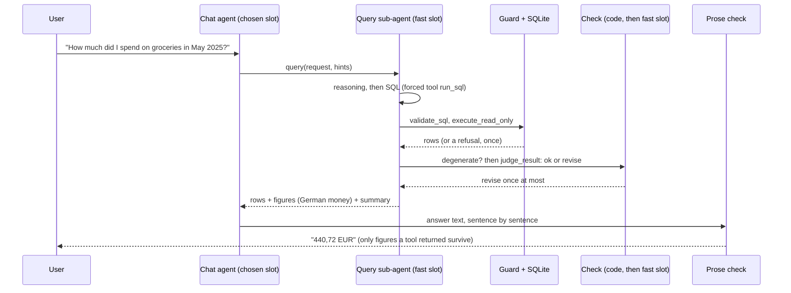

# 06: Numbers come only from executed queries

**Claim:** Every figure the assistant states came from a SQL statement a sub-agent wrote, a
guard admitted, and SQLite ran against the user's own transactions; the statement and its rows
are shown next to the answer; a statement that runs but answers the wrong question is caught by
a check pass; and a figure the model invents anyway is removed from the sentence before the
user sees it.

## How it works

In words:

1. The chat agent decides a number is needed and calls the `query` tool with a standalone
   request. It never writes SQL itself, and the system prompt forbids arithmetic in prose.
2. The query sub-agent on the fast slot gets the request, the profile facts (date range,
   accounts, taxonomy with subcategories under their category, the top merchants), nine worked
   examples, and answers through one forced tool: a `reasoning` field, then the statement.
3. The guard parses the statement with sqlglot and admits one read-only SELECT over
   `transaction_view`, then runs it on a connection whose `transaction_view` is a temp view
   already filtered to the profile, with `PRAGMA query_only` on.
4. The result is judged. In code: no rows, all-NULL figures, or a single zero on a question that
   names something the household has, trigger one rewrite with a hint. Otherwise one forced tool
   call on the fast slot reads the question, the statement and up to ten rows and says `ok` or
   `revise` with a reason and a corrected intent; a revise is one rewrite. At most three model
   calls per query.
5. The tool result carries the rows and `figures`: the same rows written as lines with every
   euro column in German format, so the model copies rather than reformats.
6. The chat agent writes the answer. A prose check compares every euro amount in every sentence
   against the figures the turn's tools returned; a sentence with a figure nobody returned is
   replaced by a sentence quoting the figures that were.
7. The transcript shows the tool step: the request, the SQL as it ran, the row count and the
   rows.

## The code path

1. `src/finquery/agent.py:SYSTEM_PROMPT`: the rule ("every number you state comes from the
   `query` tool"), how to write a standalone request, never narrow a period silently.
2. `src/finquery/agent.py:query`: the tool. Counts against `QUERY_BUDGET` (5 per turn) and
   calls `run_query`.
3. `src/finquery/query/runner.py:run_query`: the loop. `MODEL_CALLS = 3` is the ceiling,
   `ATTEMPTS = 2` the refusals allowed. Narrates "Checking the result" and "Rewriting: ..."
   through `ChatDeps.narrate`.
4. `src/finquery/query/subagent.py:load_query_context` (the profile facts),
   `query_prompt` (rules, examples, the retry framed as a correction), `write_sql` (the forced
   `run_sql` tool returning `GeneratedSql` with `reasoning` and `sql`).
5. `src/finquery/query/guard.py:validate_sql`: one statement, SELECT or set operation, only
   `transaction_view` (and CTEs), no schema prefix, no table-valued function, no
   `load_extension` and friends, no join without a condition, no CASE that invents a category
   from the booking text, at most 8 LIKE terms over the text columns, no `amount_cents` as a
   figure, no subcategory name used as a category, `/ 100` rewritten to `/ 100.0`, at most 1500
   characters, `LIMIT 200` applied. The statement is re-rendered from the parsed tree.
6. `src/finquery/query/guard.py:execute_read_only`: `CREATE TEMP VIEW transaction_view AS
   SELECT * FROM main.transaction_view WHERE profile_id = '...'`, `PRAGMA query_only = ON`, run,
   then drop the view.
7. `src/finquery/db.py:QUERY_VIEW_SQL`: the view. Joins account, category and subcategory
   names, exposes `amount_cents` and `amount` (cents / 100.0), and excludes any transaction that
   has split children (ADR 0005).
8. `src/finquery/query/check.py:degenerate_reason` (code, no model),
   `names_something`, `check_result` (the forced `judge_result` tool returning a `Verdict`).
9. `src/finquery/query/runner.py:figures` and `QueryOutcome`: the payload with `sql`, `columns`,
   `rows`, `figures`, `summary`, `error`.
10. `src/finquery/prose.py:AnswerCheck`: `clean` judges the answer sentence by sentence against
    `Figures`; `src/finquery/api/chat.py:TextFilter` runs it on the live stream and
    `collect_figures` seeds it with every figure the conversation's tools returned.
11. `frontend/src/components/query-tool.tsx:QueryToolStep`: the collapsible step with request,
    SQL, row count and rows.

## Where the model is in the loop, and where it is not

- Model: deciding that a query is needed and writing the request (chat slot); writing the SQL
  (fast slot); the `ok` or `revise` verdict (fast slot); writing the sentence around the figure.
- Not the model: the SQL guard, the profile scoping, the read-only connection, the row limit,
  the degenerate-result rule, the German formatting of figures, the prose check that removes an
  unsupported figure, the transcript rendering, and the `QUERY_BUDGET`.

## Guards and failure handling

- A guard or SQLite error goes back to the sub-agent once with the refused statement and the
  reason; a second refusal is an `error` in the payload and the prompt tells the agent to say so
  without a figure.
- Only the first statement is judged, so a refusal, a degenerate rewrite and a revise never
  stack. A rewrite whose result is degenerate while the first was not is thrown away
  (`KEPT`, "Keeping the first result").
- The chart tool passes `pinned=True` so no check pass runs on its query (its plan already fixed
  the columns).
- A profile with no transactions answers without a model at all (`NO_DATA`).
- The sixth `query` in a turn is answered by `OVER_BUDGET`, not by a model.
- A `TokenError` from an unterminated LIKE literal is a refusal, not an exception that ends the
  turn.
- The prose check only judges once a query has produced a figure in this conversation, and it
  allows every figure any tool returned plus amounts the user typed (tolerance one cent).
- Every tool is wrapped by `src/finquery/agent.py:guarded`: an unexpected exception is one
  sentence in the step, never a dead turn.

## What we measured

| Figure | Value | Source |
| --- | --- | --- |
| SQL benchmark, Gemini 3.8 Flash | 93 % figure match baseline; 95 % with the current prompt, no check; 100 % on the held-out third | `bench/README.md`, ticket 40 |
| SQL benchmark, Qwen3.5 9B | 57 % baseline (48 % held out); 69 % with the current prompt, no check (64 % held out); SQL valid 92 % to 99 % | `bench/README.md`, `bench/results/20260905T182106Z-qwen-qwen3.5-9b-nocheck-sql.md`, ticket 40 |
| SQL benchmark, Gemma 4 E4B on the laptop | 57 % figure match, 97 % SQL valid, 93 % first attempt, median 9.2 s, 152 questions in 1586.7 s (26 min), baseline prompt | `bench/results/20260905T181117Z-local-fast-sql.md` |
| Per kind, Qwen, baseline to new prompt | total 62 to 88 %, follow-up 19 to 44 %, ranking 67 to 50 % | ticket 40 |
| Ticket 37 rules on the 76-question set, Qwen | 45 % to 58 % figure match | ticket 37 |
| The guard catching a runaway match | "my flatmate" matched thirty merchants and returned 27.187,28 EUR, the whole year; now refused above 8 LIKE terms | ticket 17 |
| Demo question, local | groceries May 2025: 440,72 EUR in 63 s; German follow-up 72 s; top five merchants 73 s | `docs/demo-script.md` |
| The check catching a wrong reading | "kleinste wiederkehrende Zahlung" rewritten from a category filter to the subcategories asked for; "letztes Quartal" 7.592,08 EUR gold figure | ticket 40, browser verification |
| Cost of a query | at most three model calls; the check adds one call to most queries | ticket 40 |

## Three sentences for the talk

1. "The model never computes a number: it asks for one, a sub-agent writes SQL, a guard admits
   only a single read-only SELECT over the user's own view, and the statement and its rows are
   right there in the transcript."
2. "Valid SQL is not the same as the right SQL, so after the statement runs a second small-model
   call judges whether those rows answer that question and asks for one rewrite, and a result
   with no rows or a lone zero is rewritten in code before that."
3. "And if the model still writes a figure nothing returned, the server replaces that sentence
   on the stream with the figures the query did return, so an estimate costs the model the
   sentence."

## Likely grader questions

- **Can the SQL touch another profile's data?** No. The executing connection has a temp view
  named `transaction_view` already filtered to the profile; SQLite resolves the unqualified name
  in the temp schema first, the guard refuses a qualified `main.transaction_view`, and the
  connection is `query_only`.
- **What about a CASE that classifies bookings by text?** Refused (`_invents_a_category`): a
  category comes only from the category column; NULL is shown as Needs review.
- **Why integer cents?** SQLite has no decimal type; `SUM` over cents is exact. The view exposes
  euros as `amount_cents / 100.0`; the guard refuses bare cents in a selected figure and rewrites
  `/ 100` to `/ 100.0` (ticket 37).
- **Why not let the strong quality model write SQL?** Sub-agents are pinned to the fast slot so
  the adapters slot into one base. Qwen3.5 9B scores 69 % at best and 19 % to 44 % on follow-ups,
  so it should not write SQL either; the adapter targets E4B.
- **What does the check cost and is it worth it?** One fast-slot call on most queries. Its own
  before and after is the one number not measured: the OpenRouter key hit its limit before the
  four runs (`bench/README.md`, "What the check is worth: not measured").
- **Does the split-aware view double count?** No: a parent with children is excluded, its
  children are counted once.

## What is not finished

- The four benchmark runs with the check on (both models, both sets) and the check's median
  latency cost. Four commands are listed in `bench/README.md`.
- The ranking example in the prompt costs seventeen points on Qwen (a `LIMIT 5` the model
  copies onto rankings nobody limited).
- A 9B model judging a 9B model sometimes asks for rewrites it should not. The floor under that
  is in code; whether it nets positive is what the missing runs would say.
- There is no statement timeout on the SQLite connection (a `TODO` in `execute_read_only`).
