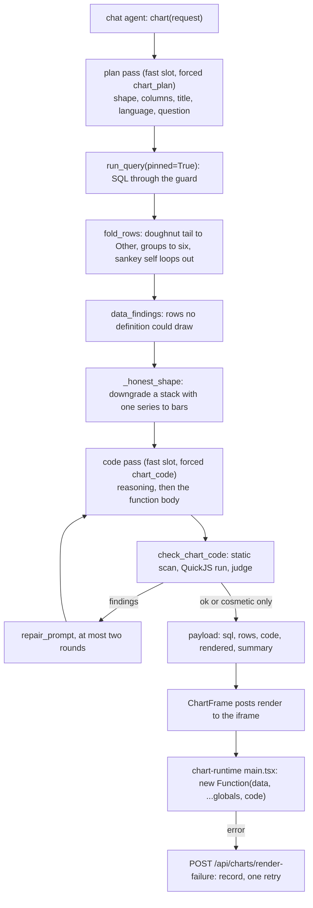

# 07: Charts as checked code in a sandboxed frame

**Claim:** A chart is JavaScript the chart sub-agent writes against 24 allowlisted globals of
TanStack Charts; the rows come from the same guarded query path as any number; the code is run
in QuickJS against recording stubs and judged by the house rules before the browser sees it,
repaired up to twice, and then drawn in an iframe with `sandbox="allow-scripts"` that has no
access to the app.

## How it works

In words:

1. The chat agent calls `chart` with a standalone request. The plan pass on the fast slot
   returns the language, the shape, the columns in role order, a title and the data question.
2. The data question goes through the ordinary query path with `pinned=True` and a hint that
   spells out the columns and, for grouped shapes, the `GROUP BY` both dimensions rule.
3. The rows are folded in code (doughnut tail into `Other`, more than five groups into one per
   position, sankey self loops dropped), then judged for what no code could draw (duplicate
   position and series pairs, a cyclic flow), then the shape is downgraded if the rows cannot
   carry it (one series in a stacked chart, fewer than three points on a line).
4. The code pass writes a `reasoning` then the body of one function. The check compiles and runs
   it in QuickJS against stubs that record what was asked for, and judges the recording against
   the house rules. A failing rule becomes a repair instruction; the repair prompt shows the
   model its own reasoning, its own code and the findings.
5. After three attempts a readable sentence replaces the chart, unless only polish is left (a
   legend nobody needs), which is shown with a note.
6. The browser card posts rows, code and theme colours into the sandboxed frame, which
   evaluates the body with `new Function` and the 24 globals and renders. An error in the frame
   is reported back; the server records it on the turn and retries once.

## The code path

1. `src/finquery/agent.py:chart`: the tool; its docstring tells the model to read `rendered`
   before writing a word about the picture.
2. `src/finquery/chart/runner.py:run_chart`: the whole pipeline, `ATTEMPTS = 3`, narrating every
   step; `_euro_last` puts the euro column last; `_honest_shape` downgrades; `_rest_share`
   puts a majority rest slice into the title; `NO_PICTURE` closes a failed summary.
3. `src/finquery/chart/subagent.py:write_plan` (forced `chart_plan`, `ChartPlan`),
   `write_code` (forced `chart_code`, `ChartCode`), `plan_prompt`, `code_prompt`,
   `repair_prompt`, `CONTRACT` (the rules in words), one worked example per shape.
4. `src/finquery/chart/shapes.py:SHAPES`: the eight shapes with their marks, `series`,
   `crossed`, `zero_from_mark`; `MAX_SLICES` and `MAX_SERIES` are 6.
5. `src/finquery/chart/fold.py:fold_rows`: the fold, shared with the dashboard.
6. `src/finquery/chart/selfcheck.py:check_chart_code`: `_static_findings` (forbidden names,
   inline data), `_run_in_quickjs` (2 s, 64 MB), `judge` (one definition, `data` read, mark,
   shape and house findings, deduplicated); `data_findings` for the row rules;
   `is_cosmetic` for the two legend rules.
7. `frontend/src/components/chart-tool.tsx:ChartFrame`: the iframe, the `hello`/`render`/
   `ready`/`error` protocol, a re-post on theme change; `ChartToolStep` the card.
8. `frontend/src/chart-runtime/main.tsx:buildChart`: `new Function('data', ...GLOBAL_NAMES, code)`,
   then the frame's own scales, tooltip, animation and theme.
9. `frontend/src/chart-runtime/globals.ts:GLOBAL_NAMES` and `globalValues`: the 24 globals
   (TanStack marks, scales, `polar`, `pie`, `radialArc`, `sankeyDiagram`, `tooltip`,
   `colorLegend`, plus `palette`, `eur`, `eurShort`, `monthShort`).
10. `frontend/src/lib/chart-frame.ts:CHART_HEIGHT` (280) and the message types.
11. `src/finquery/api/charts.py:render_failure`: records `rendered: false` on the turn in both
    message families and runs one retry through `run_chart`.
12. `docs/chart-runtime.md`: the contract, kept in step with the stub and the runtime.

## Where the model is in the loop, and where it is not

- Model: the plan (shape, columns, title, language), the SQL (via the query sub-agent), the
  chart code, and the repairs.
- Not the model: the guard on the SQL, the fold, the impossible-rows rules, the downgrade, the
  QuickJS check and its rules, the height, width, palette, animation, axis chrome, tooltip
  styling, month labels in the request's language, the doughnut's centre total (the slices
  summed in the frame), the sandbox, the render failure record and retry, the dashboard fold
  parity.

## Guards and failure handling

- The code runs first in QuickJS with a time and memory limit; a thrown error is a finding.
- Forbidden names: `import`, `require`, `fetch`, `window`, `document`, `eval`, `setTimeout`,
  `globalThis`. Data typed into the code is a finding.
- The iframe has an opaque origin: no cookies, no storage, no API. It costs one header
  (`access-control-allow-origin: *` on `/assets/*`).
- `rendered` on the payload is what the chat agent reads; false means "no picture, give the
  figures from `rows`". The summary of a failed chart repeats that instruction in full.
- A chart that passed the check and still failed in the browser is recorded on the turn and
  retried once; a second report only records.
- Rows no definition could draw are refused before the code pass, so no repair round is spent
  on them.
- A chart's query is `pinned`, so it costs what a chart cost before ticket 40.

## What we measured

| Figure | Value | Source |
| --- | --- | --- |
| Chart quality pass, 24 requests, OpenRouter fast slot | good on the first attempt 5/24 to 18/24; no house-rule finding 8/24 to 24/24; caption in the request's language 19/24 to 24/24; mean 31.0 s to 32.0 s | ticket 25 |
| Chart benchmark, Gemini 3.8 Flash, 63 requests | 92 % figure match baseline, 97 % after ticket 42; 98 % drawn; 97 % first attempt; median 6.3 to 7.2 s | `bench/README.md`, `bench/results/20260905T183545Z-google-gemini-3.8-flash-chart.md` |
| Chart benchmark, Qwen3.5 9B | 40 % figure match, 60 % drawn, 38 % first attempt, 2.08 model calls per chart; doughnut 12 %, area 0 % | `bench/README.md` |
| Chart benchmark, Gemma 4 E4B on the laptop | 48 % figure match, 100 % SQL valid, 86 % shape match, 73 % drawn, 46 % first attempt, median 36.0 s, 63 requests in 2527.5 s | `bench/results/20260905T183745Z-local-fast-chart.md` |
| E4B per shape, local | line 90 %, bar_horizontal 83 %, bar 67 %, doughnut 38 % (12 % drawn), area 0 %, sankey 0 % | same file |
| Demo, local | area chart 96 s; horizontal bars 86 s; doughnut 118 s and not drawn (no `color` channel on `radialArc`, three rounds) | `docs/demo-script.md`, ticket 17 |
| Repair framing | three rounds that only said "write it again" returned the same finding three times before the correction framing | `docs/chart-runtime.md` |

## Three sentences for the talk

1. "A chart is code the small model writes against twenty-four allowed names, and before the
   browser sees a line of it we run it in QuickJS against stubs that record what it asked for and
   judge that against the house rules: one definition, columns that exist, the planned shape, a
   euro axis with a zero, a legend only with several series."
2. "The findings go back in the same words as repair instructions, twice at most, and the plan
   and every repair are narrated into the thinking panel, so the user watches the chart being
   made."
3. "Then it renders in a sandboxed iframe with an opaque origin, and the card carries the SQL
   and the rows next to the drawing, so a chart is auditable the same way a number is."

## Likely grader questions

- **Why generated code and not a JSON chart spec?** A spec is a chart library of our own with
  extra steps (every TanStack option plumbed through), and a fixed component set cannot express a
  sankey or a grouped stack. Code plus an allowlist plus a check gives the whole library for the
  price of three lists (ADR 0009).
- **Is this the "secure execution of generated code" elective?** No, we do not claim it. The
  sandbox exists because a broken chart is worse than no chart, and the JavaScript sandbox is
  worth describing, but the elective was dropped (`DECISIONS.md`, 2026-09-01).
- **Why does the doughnut fail on E4B?** The code pass never gives `radialArc` its `color`
  channel, three rounds running, on that model. The rows are folded fine; the card then says so
  and the answer gives the six figures. The dashboard's own doughnut draws because its code is in
  the repo.
- **What stops the code from reading the user's data?** It only ever receives `data`, the rows of
  an executed query, and the frame has no origin, no storage and no API.
- **Why is the check not the browser?** QuickJS judges intent against a stub; the real layout can
  still throw (a stack with two values at one position). That path is caught before the code
  pass by `data_findings`, and anything left is recorded and retried once.

## What is not finished

- The doughnut and the area shape on the local fast slot. The chart adapter is what should fix
  the code pass; it is not trained (04).
- Qwen's chart re-run after ticket 42 stopped at 26 of 63 datapoints when the OpenRouter key ran
  out; its 40 % is still the baseline number.
- When a chart fails in the browser after the answer was already written, the sentence above the
  card is stale; re-running the turn is a bigger change (tickets 22, 25).
- Tickets 44 (a `keep` flag on the chart tool for long-term charts) and 45 (square corners inside
  charts) are running in parallel and are not on `main`.
