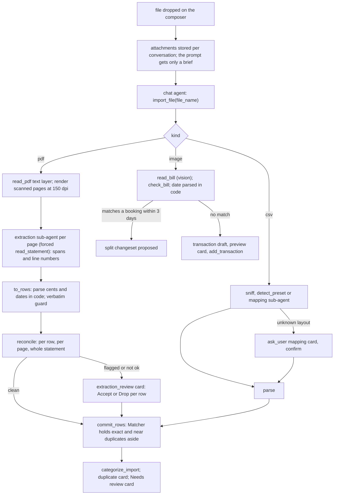

# 08: Ingestion with two guards on every extracted figure

**Claim:** Every import happens in the chat. A CSV is parsed (six bank presets, or a mapping the
fast slot proposes and the user confirms on a card), a statement PDF is read page by page by
the extraction sub-agent which points at literal spans, a photo is read by the vision path, and
two guards decide what may be committed: every figure must be printed in the source text
(verbatim guard) and the statement must add up (reconciliation guard). What fails goes to a
review card; nothing is dropped and nothing is inserted silently, including duplicates.

## How it works

In words:

1. The bytes of a dropped file are stored on the conversation and never enter the prompt; the
   agent is told the file name, kind, size and whether it was imported.
2. `import_file` routes by kind. CSV: sniff delimiter and encoding, match a preset by header
   (Sparkasse, DKB, ING, N26, comdirect, Trade Republic) or ask the mapping sub-agent and show
   the proposal on a Question card; parse German decimals and dates; commit.
3. PDF: pdfplumber words are grouped back into printed lines; a page with no text layer is
   rendered and read as an image. One sub-agent call per page (4 in flight locally, 12 hosted)
   returns rows as spans: `date_text`, `amount_text`, `balance_text`, a line number and a
   direction. The cents and the date are parsed from those spans in code.
4. The verbatim guard checks each span occurs literally in the page text (a date may be split
   over two printed lines). The reconciliation guard walks the running balance row by row, per
   page and over the statement, against printed opening and closing balances where the layout
   says they apply. Flagged rows and a statement that does not add up go to a review card.
5. Photo: the vision path reads merchant, date, total and line items; the items are held to the
   printed total; a subtotal line is not an article; a foreign currency is refused. A total that
   matches a money-out booking within three days becomes a proposed split of that booking into
   the items grouped by category; otherwise it is a draft on a preview card.
6. Every path ends in `commit_rows`, where the duplicate matcher holds exact and near matches
   aside as candidates. The user answers Keep both or Remove on a card, five at a time, with a
   remove-all row above 25 exact candidates.
7. Then categorization (09) and the Needs review card.

## The code path

1. `src/finquery/api/attachments.py:take_uploads` and `store_uploads`;
   `src/finquery/attachments.py:brief` is the instruction block naming the files.
2. `src/finquery/agent.py:import_file`: the tool; `extract_transaction` and `add_transaction`
   for typed and pasted text.
3. `src/finquery/ingest/chat_import.py:import_attachment`: routes by kind to `_import_csv`,
   `_import_statement`, `_import_bill`; `mapping_card` builds the confirmation card;
   `_imported` composes the counted summary, the duplicate card and what is left to do.
4. CSV: `src/finquery/ingest/csv_reader.py:sniff`, `detect_preset`, `mapping_for`, `parse`,
   `parse_amount` (German decimals, parentheses as money out), `parse_date`;
   `src/finquery/ingest/mapping_agent.py:propose` (forced `propose_mapping`, header plus five
   sample rows).
5. PDF: `src/finquery/extract/pdf.py:read_pdf` (lines with positions), `render` (150 dpi),
   `as_image`; `src/finquery/extract/layouts.py:detect_layout` (Sparkasse, Trade Republic,
   unknown, each with a hint and balance labels); `src/finquery/extract/subagent.py:read_statement_text`
   and `read_statement_image` (forced `read_statement`), `statement_retry`;
   `src/finquery/extract/statement.py:extract_statement` (the per-page gather, one reread on a
   verbatim refusal, then the guards), `commit_extraction`.
6. Guards: `src/finquery/extract/guards.py:to_rows` (parse spans in code, then `_verbatim`),
   `occurs`, `date_occurs`, `reconcile` (`_chain` also fixes a direction the balance
   contradicts), `flag_unverified` for image pages.
7. Review: `src/finquery/extract/review.py:review_card` (up to four flagged rows plus a rest row,
   or one "import it anyway" row), `apply_review` (commits the accepted rows through
   `commit_extraction`, recomputes the verdict, categorizes).
8. Receipts: `src/finquery/extract/bill.py:read_bill_image` (forced `read_bill`),
   `check_bill` (items against the printed total, subtotals dropped, currency), `bill_date`
   (parsed in code), `find_match` (`MATCH_DAYS = 3`), `split_intent` (legs grouped by the
   categorizer), `bill_outcome`.
9. Typed text: `src/finquery/ingest/typed.py:propose_transactions` (forced
   `propose_transactions`, unsigned amount plus direction), `store_drafts`, `preview_card`,
   `add_draft` (writes from the stored draft, never from retyped figures; single-row duplicate
   check).
10. Commit and duplicates: `src/finquery/ingest/commit.py:commit_rows` and `import_summary`;
    `src/finquery/ingest/duplicates.py:Matcher` (`take`: exact on account, date, amount and
    normalized description; near on same amount within 2 days and a similar description, ratio
    0.72), `hold`, `card`, `apply_decisions`, `apply_answers`.
11. Answers applied in code: `src/finquery/answers.py:resolve_answers` dispatches
    `duplicate_decision` and `extraction_review` cards; `mapping_confirmation` and
    `transaction_draft` are passed to the model, whose next tool call does the work.
12. Progress: `src/finquery/progress.py` transient `data-import_progress` parts;
    `frontend/src/components/import-tool.tsx:ImportToolStep`.
13. Overview: `src/finquery/api/imports.py:list_imports`, `delete_import`,
    `review_conversation`; `frontend/src/components/imports-list.tsx`.

## Where the model is in the loop, and where it is not

- Model: a CSV mapping for an unknown header (once, confirmed by the user); pointing at the
  spans on a statement page; reading a photo; grouping receipt items by category; deciding to
  call `import_file` at all.
- Not the model: presets (never a model call), parsing amounts and dates from spans, both
  guards, the verdict sentence, the direction fix from the balance chain, duplicate matching,
  the commit, the counted summary, the remove-all shortcut, the sample year import in
  onboarding (`src/finquery/api/onboarding.py:load_sample_year` seeds the turn with no model).

## Guards and failure handling

- Verbatim: an amount the model reformatted (`-1150.00` for `-1.150,00`) is flagged even though
  its value is right; the guard cannot tell a rewrite from an invention (ADR 0011).
- Reconciliation returns `ok`, `failed` or `not_checkable` with one sentence, recomputed on the
  server over exactly the rows committed.
- Image pages have no text to check against, so their rows are flagged `unverified` and the
  balance chain is the only proof.
- A receipt in another currency is refused with a sentence: booking 8,27 PLN as 8,27 EUR is the
  one mistake nothing later would catch. A receipt whose date cannot be read asks for it on the
  card instead of booking today.
- `SUBAGENT_MAX_TOKENS` bounds a page read; before it existed a three-page extraction ran until
  the context was full (ticket 11).
- A verbatim refusal triggers one reread with the refused rows and the finding; the second
  reading is kept only when the guard refuses less of it (ticket 42).
- CSV edge cases fixed with tests (ticket 31): duplicate header names, ragged rows kept as
  issues, `(4,90)` as money out, `0,00` in the unused money column, 500-character cap on
  descriptions, control characters dropped, a description that reads as SQL is data.
- A corrupted PDF is one sentence, pypdf's words go to the log.

## What we measured

| Figure | Value | Source |
| --- | --- | --- |
| Sample year, local | 433 bookings in 32 s: 384 by the dictionary, 24 by the categorizer, 25 Needs review | `docs/demo-script.md`, ticket 17 |
| Statement PDF, 15 pages, OpenRouter | 433 of 433 bookings, 0 flagged, reconciled (4.210,55 + 5.699,01 = 9.909,56), 131 s with four pages in flight | ticket 11 |
| Same PDF, local fast slot | 433 of 433, 0 flagged, reconciled, 1458 s (about 97 s a page) | ticket 17, `docs/demo-script.md` |
| Same PDF after the ticket 42 prompt | 432 of 433, 1 flagged, reconciliation failed naming the row and the 66,30 EUR gap (the guard doing its job) | ticket 42 |
| Twenty public receipts, before to after ticket 42 | total read 19/19; items add up 15 to 16 of 20; date right 20 to 19 of 20; euro receipt refused as foreign 1 to 0 | ticket 42 |
| Bill photo split, local | 100 s; seven items summing to 20,73 EUR matched to the EDEKA booking of 14.03.2025 | `docs/demo-script.md` |
| Scanned page read as an image | 22 s, 28 bookings; an earlier run read 12 and the chain caught it with a 500,86 EUR difference | ticket 11 |
| Second import of the same CSV, local | 433 duplicate candidates in 58 s, nothing inserted | `docs/demo-script.md` |
| PDF against its own CSV | 7 of 433 not recognized as duplicates (counterparty vs purpose line; the near-match rule wants a similar description) | ticket 11 merge |
| 10.000 row CSV | imports; a second import is 10.000 candidates in 3,5 s | ticket 31 |
| Old-repo feasibility | 37 to 40 booking statements at 100 % precision and recall; a near-duplicate trap caught by reconciliation (recorded measurement, harness retired) | `DECISIONS.md` on `archive/old-main` |

## Three sentences for the talk

1. "A PDF is the one place a model has to turn a printed page into numbers, so the sub-agent is
   not allowed to return numbers: it returns the printed spans and a line number, and the code
   parses the cents and checks that every span really is on that page."
2. "Then the statement has to add up: opening balance plus every booking equals the closing
   balance, row by row on the running balance, per page and as a whole, and a row that fails
   either check goes to a card where you accept, correct or drop it."
3. "Every import path ends in one commit, and that commit never inserts a booking the profile
   may already have and never drops one: it holds it aside and asks you, Keep both or Remove."

## Likely grader questions

- **What if the statement has no balances?** `not_checkable`, and the user decides on the card.
  Trade Republic prints an overview of the whole export on every frame, so that layout declares
  no balance labels and is checked on its running balance alone.
- **Why is the PDF not in the live demo?** 24 minutes on the laptop. It works and reconciles; the
  script shows it on OpenRouter (131 s) or on a pre-imported profile.
- **How do you know the guards catch anything?** The HTTP-seam tests run the real 15-page
  fixture through the real pipeline with a scripted reader that is asked to misread one booking,
  and assert the card. The ticket 42 rerun lost one booking of 433 and the guard named the row.
- **Why not OCR?** There is no OCR. A page with no text layer is rendered and looked at by the
  vision path; a scanned page gets the reconciliation guard only.
- **Why do you keep the near-duplicate threshold if it misses 7 of 433?** A miss costs one
  duplicate the user can delete; a false match would silently lose a real repeated payment. It
  errs towards inserting and asking.

## What is not finished

- A page whose own balance chain breaks is not reread the way a verbatim refusal is;
  reconciliation runs over the whole statement after the pages are gathered (ticket 42, "What is
  left").
- Only two statement layouts are recognized by header (Sparkasse, Trade Republic); others get
  the generic hint.
- OFX, MT940, CAMT and XLSX importers are out of scope (`.scratch/finquery/spec.md`).
- Receipts are measured on twenty public receipts plus one real one; the real Trade Republic
  data is private and never shipped.
