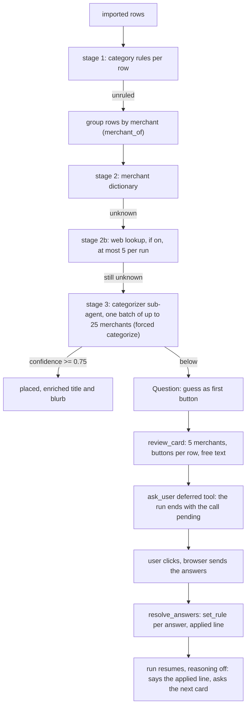

# 09: Categorization, rules and Question cards

**Claim:** After an import every booking goes through four stages in order: the profile's own
rules, a merchant dictionary, the web lookup (only when switched on), and the categorizer
sub-agent per merchant with a confidence. What stays below 0.75 is Needs review and is asked
about on a Question card in the chat; each answer becomes a category rule that the server
applies in code to every matching booking before the model speaks again.

## How it works

In words:

1. Rules first, per row. A rule is a pattern matched against the folded description and
   counterparty; it wins over everything.
2. Rows are grouped by merchant (`merchant_of` strips processors, branch numbers, legal forms
   and cities), so the 433 bookings of the sample year are 39 merchants.
3. The dictionary knows about sixty German merchants with a category and a blurb.
4. With web lookup on, up to five unknown merchants per run are looked up (15).
5. What is left goes to the categorizer sub-agent in one batch: a `reasoning` line per merchant,
   then category, subcategory, confidence, title and blurb. A batch naming a category the
   household does not have is resubmitted once with the finding.
6. At or above the threshold the merchant is placed. Below it the merchant becomes a Question
   with the guess as its first button and the categories in use as the others.
7. The card is the `ask_user` deferred tool: the run ends with the call pending, no model slot
   waits. The browser puts the answers on the card's own message and sends that message.
8. The server matches the answers to the open call, applies them in code (one `set_rule` per
   answered row, recategorizing every booking of that merchant), writes the `applied` line on the
   card, and resumes the same run with reasoning off. The model summarizes and asks for the next
   card with `review_batch`.

## The code path

1. `src/finquery/categorize/pipeline.py:categorize_rows`: the stages, the `Report` counters
   (`by_rule`, `by_dictionary`, `by_lookup`, `by_model`, `needs_review`), the `Question` list;
   `categorize_import`, `pending_questions`, `review_card` (`QUESTIONS_PER_CARD = 5`),
   `group_rows`, `_look_up`, `_ask_model`.
2. `src/finquery/categorize/merchants.py:merchant_of`, `fold`, `lookup`, `DICTIONARY`.
3. `src/finquery/categorize/rules.py:matching_rule`, `set_rule` (stores the `CategoryRule`,
   recategorizes every matching booking, refuses a bulk phrase like "all Netflix rows"),
   `apply_answers` (the card applier, returns `Applied` with the `applied` and `say` lines).
4. `src/finquery/categorize/subagent.py:categorize_merchants` (forced `categorize`,
   `BATCH_SIZE = 25`, `CONFIDENCE_THRESHOLD = 0.75`, one resubmit via `refusals` and
   `resubmit_prompt`), `categorize_prompt`, `taxonomy_block`.
5. `src/finquery/taxonomy.py:DEFAULT_TAXONOMY`: 16 default categories with subcategories one
   level deep, `Unknown` with none; `Needs review` is `category_id IS NULL`.
6. `src/finquery/ask_user.py:AskUser`, `AskRow`, `AskAnswers`, `AskApply`; `AskUserToolset`
   validates that a card has rows or options (`_answerable`, `NOTHING_TO_ANSWER`) with
   `CARD_RETRIES = 2`; `unwrap_card` tolerates a card the model nested under `card`.
7. `src/finquery/agent.py:review_batch` (the next card, with a ready `card`), `set_rule` (the
   teaching statement tool), `review_duplicates`.
8. `src/finquery/api/chat.py:chat`: `History.open_tool_calls` finds the pending call in any
   turn, `_tool_outputs` matches the browser's answers, `resolve_answers` applies them, the run
   resumes with `deferred_tool_results` and `state.subagent_settings` (reasoning off), and
   `persist_turn(replaces=...)` rewrites the turn in place; `card_the_model_did_not_ask` appends
   the card when the model wrote about it instead of calling `ask_user`.
9. `src/finquery/answers.py:resolve_answers` and `APPLIERS` (`category_rule`,
   `duplicate_decision`, `extraction_review`).
10. `frontend/src/components/question-card.tsx:QuestionCard`;
    `frontend/src/components/chat-view.tsx:answerCard` puts the output on the message the card
    is on and sends that one message (ADR 0008, ticket 29).
11. `src/finquery/api/imports.py:review_conversation` seeds a card turn that nobody streamed;
    `src/finquery/api/onboarding.py:load_sample_year` does the same for the sample year.

## Where the model is in the loop, and where it is not

- Model: the categorizer's guess per merchant with a confidence, the enriched title and blurb,
  the mapping of a receipt's items to legs; the chat model's one line after a card.
- Not the model: rules, the dictionary, grouping by merchant, the threshold, building the card,
  applying the answers, writing the rule, recategorizing the rows, the `applied` and `say`
  lines, the counted summary. Asking the fast model to sequence N `set_rule` calls itself is
  what looped for 145 seconds and stored nothing on 2026-09-04 (ADR 0008).

## Guards and failure handling

- `Unknown` is a real category a human picks; automation never writes it. Needs review is an
  absence.
- A card with nothing answerable is refused with a `ModelRetry` before the run parks on it; a
  refused card leaves nothing behind in the transcript (ticket 30, B2).
- A card answered after a newer message resumes its own turn; the prompt for that run ends
  where that turn ended and the summary marker is clamped one turn short (ticket 29).
- A second answer to a closed card is 409, not a replay of the appliers.
- `set_rule` refuses a pattern that reads as a bulk request and points to `propose_changeset`.
- The categorizer's answer that names a foreign category or leaves a merchant out is resubmitted
  once; what is still unusable is Needs review, never a wrong placement.
- A tool the model narrated instead of calling is shown by the server
  (`card_the_model_did_not_ask`), so the next card is never missing.
- The resumed half runs with reasoning off, because the fast model collapsed into a repetition
  loop at that boundary (ticket 20).

## What we measured

| Figure | Value | Source |
| --- | --- | --- |
| The sample year, OpenRouter fast slot | 39 merchants, one model call, 94.2 % of rows categorized (0 by rule, 384 dictionary, 24 model), 25 Needs review (the four PayPal friends at 0.4), 39 of 39 enriched titles and categories correct | ticket 07 |
| Same after the ticket 42 prompt | identical line for line; 408 of 433 categorized | ticket 42 |
| Answering a card, local | 3 rows: 67 s; the last row: 54 s; the `Applied:` line on the card within a second | `docs/demo-script.md` |
| Resumed half with reasoning off | about 4 s, against a 23.000 character repetition loop and 145 s before | ticket 20 |
| Rules applied before the model spoke | three answers in the database within three seconds of Send | ticket 20 merge verification |
| Web lookup as a stage | a small import: `by_dictionary 1, by_lookup 2, by_model 0, model_calls 0` | ticket 14 |
| Old-repo dictionary coverage on real data | 66.6 % frequency-weighted, 37 % of unique descriptions (851 card transactions), recorded measurement | `DECISIONS.md` on `archive/old-main` |

## Three sentences for the talk

1. "Categorization is a pipeline where the model comes last: your own rules, then a merchant
   dictionary, then the small model once per merchant with a confidence, so the sample year is
   one model call for 433 bookings."
2. "What the model is unsure about becomes a card in the chat with the guess as a button, and
   the card is a deferred tool: the run ends, no model waits for you, and you can answer an hour
   later or after asking something else."
3. "Your click is applied by the server, not by the model: each answer becomes a rule that
   recategorizes every booking of that merchant, the card shows what was applied, and only then
   does the model get to say one line and ask the next card."

## Likely grader questions

- **Why per merchant and not per booking?** 433 bookings are 39 merchants; one batch answers
  them all. Per booking would have been 18 calls and minutes per import (ticket 07).
- **Why not let the model call `set_rule` for each answer?** It looped for 145 s and created
  nothing. Applying in code is deterministic and takes four seconds (ADR 0008, ticket 20).
- **How does a deferred tool work in Pydantic AI?** `ask_user` is an `ExternalToolset` with no
  function; the agent's `output_type` is `[str, DeferredToolRequests]`, so a run that calls it
  ends with the call pending. The answers come back as `deferred_tool_results` on the same
  history.
- **Why is 94.2 % a fair number?** The 25 left are four people paid through PayPal, which no
  dictionary and no model should place; the honest answer is to ask.
- **What does "Needs review" mean versus "Unknown"?** Needs review is `category_id IS NULL`, a
  state. Unknown is a seeded category only a human assigns.

## What is not finished

- The dictionary is a seed of about sixty merchants; coverage grows per profile through rules.
- The categorizer is measured on a dataset that barely exercises it (seven of 39 merchants reach
  it). Real merchants live in the private Trade Republic export, which is never shipped.
- Ticket 47 (deleting categories and subcategories in onboarding through the changeset path) is
  running in parallel and not on `main`.
