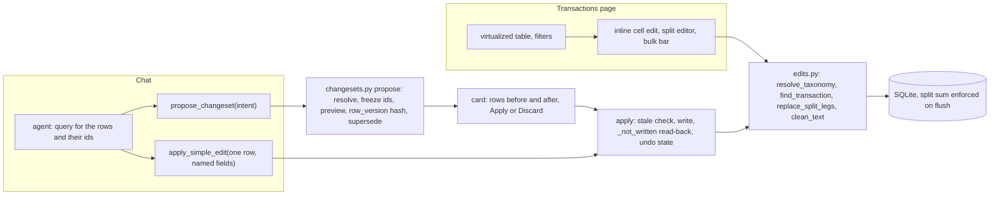

# 10: The Transactions page and edits through changesets

**Claim:** Every write to a booking is deterministic code that the Transactions page, a
changeset card and a Question card share. An edit the user literally asked for applies at once
with Undo; anything touching several rows is a changeset: a preview of the exact affected rows,
inert until Apply, stale if the rows moved, and verified by reading the database back before
it says Applied.

## How it works

In words:

1. The page lists the profile's bookings through one endpoint with filters (text, date range,
   category, account, Needs review), 500 rows a page, virtualized. A cell is edited in place, a
   row expands into its split legs, selected rows can be recategorized or deleted.
2. In chat the agent first queries for the rows and their ids. One row and a change the user
   spelled out goes through `apply_simple_edit`, which applies immediately and returns an undo
   token. Everything else goes through `propose_changeset`.
3. A proposal resolves the intent (ids or a selection, category names, legs, a taxonomy
   operation) into a payload of frozen ids, computes the preview rows (before and after as
   display strings), hashes the current state of the affected rows, and retires any older open
   proposal about the same rows.
4. The card shows the preview with Apply and Discard. Apply recomputes the hash; a mismatch turns
   the changeset `stale` and refuses. The write goes through the same resolvers the page uses,
   then the database is read back inside the same transaction; only if the effect is there does
   the status flip to `applied`.
5. Recategorize and edit store the before state, so they can be undone; the Settings taxonomy
   editor proposes the same changesets for add, rename, merge and delete.

## The code path

1. `src/finquery/api/transactions.py:list_transactions` (filters, `include_parents`),
   `patch_transaction`, `create_transaction`, `replace_splits`, `bulk_recategorize`,
   `bulk_delete`.
2. `src/finquery/edits.py:resolve_taxonomy`, `resolve_names`, `find_transaction` (a row of
   another profile is not found), `listing_conditions` (the filter the page and a selection
   share), `replace_split_legs` (at least two legs), `clean_text` (500 characters, no control
   characters), `TransactionEditError`.
3. `src/finquery/db.py:_enforce_split_sums`: the session `after_flush` listener that raises
   `SplitSumError` when children do not sum to the parent (ADR 0005), so every writer gets it.
4. `src/finquery/agent.py:propose_changeset` (`retries=2`, every refusal a `ModelRetry`),
   `apply_simple_edit` (`_may_write_the_amount`: the amount must be in the user's own words or
   equal to the row, `AMOUNT_NOT_ASKED_FOR`).
5. `src/finquery/changesets.py:ChangesetIntent`, `Selection`, `SplitLeg`, `TaxonomyChange`;
   `propose` (`_resolve`, `_freeze`, `_preview`, `row_version`, `_supersede`); `apply`
   (`ChangesetStale`, `_not_written`); `undo`, `discard`, `refresh`; `UNDOABLE`.
6. `src/finquery/api/changesets.py`: `POST /api/changesets`, `GET .../{id}` (marks a moved
   proposal stale on the way out), `/apply`, `/discard`, `/undo`.
7. `frontend/src/components/transactions-page.tsx:TransactionsPage`,
   `frontend/src/components/transactions-table.tsx:TransactionsTable` (TanStack Table plus
   react-virtual), `frontend/src/components/transaction-cells.tsx:PickerCell`,
   `frontend/src/components/split-editor.tsx:SplitEditor`.
8. `frontend/src/components/changeset-card.tsx:ChangesetCard` (reads the server status after a
   reload), `ChangesetEffect` (reused by `frontend/src/components/taxonomy-card.tsx`).
9. `src/finquery/nullish.py`: a model that writes `"null"` into an optional field gets the
   absence it meant (used by `ChangesetIntent` and the card models).

## Where the model is in the loop, and where it is not

- Model: deciding which tool fits, finding the rows through `query`, naming the intent (kind,
  title, ids or filter, category names, legs).
- Not the model: resolving names, computing the preview, the hash, superseding, applying,
  verifying the write, undo, the page's own edits, the split sum rule, the taxonomy editor.
  Nothing in `changesets.py` calls a model.

## Guards and failure handling

- A proposal that matches no row is refused, not stored (a dead card otherwise).
- `where: {}` (an empty filter that would select every booking) is refused with a sentence.
- `legs: null` on a recategorize is read as absent instead of burning three retries
  (ticket 37).
- `apply_simple_edit` refuses an amount the user did not name; `amount_cents: 0` zeroed a real
  booking in the review of 2026-09-05 before that guard.
- Stale apply is 409 and the card flips to "Out of date", also after a reload.
- `_not_written` flushes and reads back: legs and their sum, the category, description, amount
  or date, or that a delete left nothing behind. A refusal is a 400 and the changeset stays
  `proposed` (ticket 30, B3).
- Splitting into one leg is refused in one place (`replace_split_legs`), so the editor, the
  changeset and the receipt path agree.
- Deleting a category in use moves its bookings to Needs review, none are deleted (ticket 31).

## What we measured

| Figure | Value | Source |
| --- | --- | --- |
| 10.000 rows | first page in 7 ms, offset 9000 in 22 ms; the table scrolls to row 9998 instantly | ticket 04 |
| Bulk changeset in chat, local | proposal 66 s (12 Amazon Prime rows), Apply instant | `docs/demo-script.md` |
| Apply, Undo | instant, no model | `docs/demo-script.md` |
| Split from a bill photo, then the table | three legs written, parent shows the split badge, legs sum to the parent | ticket 11, ticket 30 (Edeka, Rossmann, OBI: 3, 2 and 4 legs) |
| Edge cases | 14 defects found and fixed with tests, 3 of them silent data loss or corruption in the CSV reader | ticket 31 |
| Stale path | amount changed underneath a proposed split, Apply is 409 with the reason | ticket 09 |
| Changeset tests | 13 at the HTTP seam in `tests/test_changesets.py` plus six for the edge cases | tickets 09, 31 |

## Three sentences for the talk

1. "The model never writes a booking directly: it proposes, the card shows the exact rows
   before and after, and Apply is deterministic code that the Transactions page and the Settings
   editor share."
2. "A proposal remembers a hash of the rows it saw, so if anything moved underneath it the card
   turns stale and refuses instead of applying to a state nobody looked at."
3. "And Apply reads the database back before it says Applied, because a card that claims a write
   over an unchanged database is worse than a card that fails."

## Likely grader questions

- **Why two tools, `apply_simple_edit` and `propose_changeset`?** One row the user pointed at
  and spelled out gets no ceremony and an Undo. Anything else, or anything not literally asked
  for, needs the preview first. The prompt's "Changing the data" block says which is which.
- **Why is "recategorize all Netflix rows" a changeset and not a rule?** A rule is a teaching
  statement about a merchant going forward; moving rows that already exist is a bulk change the
  user should see first. `set_rule` refuses a bulk phrase (ticket 20).
- **Can a split break the account total?** No: children must sum to the parent, enforced on
  flush for every writer, and queries count only the children.
- **What can be undone?** Recategorize, edit and `apply_simple_edit`. Split, delete and taxonomy
  cannot; the card says so (`UNDOABLE`).
- **How does the page stay fast with many rows?** Offset paging of 500 through one query with
  the filters pushed to SQL, and a virtualizer in the browser.

## What is not finished

- Undo for split, delete and taxonomy changes (recreating deleted rows is the noted upgrade
  path).
- Ticket 46 (a shadcn date range picker for the filter bar) is running in parallel; on `main`
  the From and To fields are native date inputs.
- The Account column truncates without an ellipsis at 1440 (a known polish item, ticket 17).
