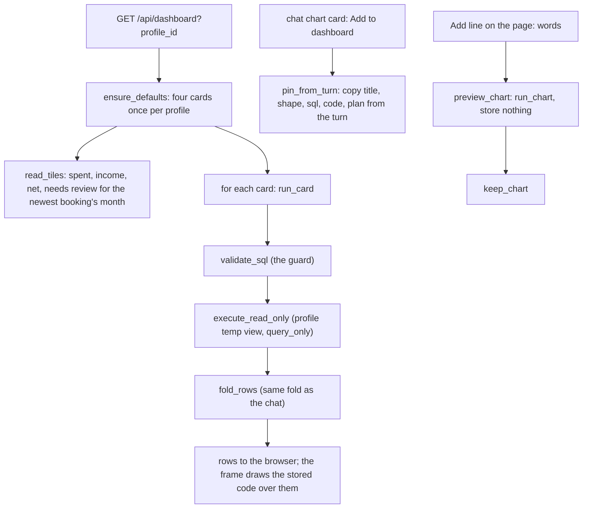

# 11: A dashboard that stores statements, never figures

**Claim:** The Dashboard page shows four tiles and a set of chart cards per profile. A card
stores a title, a shape, the SQL and the checked chart definition; on every load the statement
is re-run through the same guard and the same profile-scoped view a chat question goes through,
folded the same way the chat folded it, so the numbers are the data's and no figure is ever
stored. The four defaults are code in the repo and cost no model call.

## How it works

In words:

1. The first visit seeds four cards from fixed statements and definitions written in the repo:
   spending per month (line), spending by category for the last three months (doughnut, folded
   in its own SQL), income against spending per month (grouped bars), top ten merchants (bar
   horizontal). A profile is marked seeded, so an emptied dashboard stays empty.
2. Every load runs each card's statement through `validate_sql` and `execute_read_only` with the
   card's own profile, then `fold_rows` with the card's shape and language. The browser gets the
   rows and draws the stored code in the same sandboxed frame the chat uses.
3. The tiles are plain figures from guarded queries over the month of the newest booking, not
   today, and they name that month.
4. A chart drawn in a chat is pinned with one click: the turn's stored chart is copied onto a
   card (idempotent; a second Add finds the card). The card in the transcript says "On the
   dashboard" after a reload through `GET /dashboard/pins`.
5. A line typed on the page runs the same chart sub-agent through `run_chart`, shows the result
   with Keep and Discard, and stores it on Keep. Cards can be renamed, moved, refreshed and
   removed.

## The code path

1. `src/finquery/dashboard.py:ensure_defaults`, `DEFAULTS` (`MONTHLY_SQL`, `CATEGORY_SQL`,
   `INCOME_SQL`, `MERCHANTS_SQL` and their `*_CODE`), `LATEST_DAY` (`MAX(booked_on)`).
2. `src/finquery/dashboard.py:read_tiles`, `run_card` (`REJECTED` and `FAILED` sentences),
   `cards_of`, `append`, `move`, `renumber`, `touch`.
3. `src/finquery/api/dashboard.py:get_dashboard`, `get_pins`, `pin_from_turn` (422 for a chart
   that was never drawn; the SQL is validated before it is stored), `preview_chart`,
   `keep_chart`, `patch_chart`, `delete_chart`, `refresh_chart`.
4. `src/finquery/chart/fold.py:fold_rows`: one function, two callers (the runner before the code
   pass, the dashboard on every load), keyed by the column order the plan fixed (ticket 39).
5. `src/finquery/db.py:DashboardChart`: profile, position, title, shape, language, request,
   plan, sql, code, notes, `created_from` (`default`, `chat`, `dashboard`), the source turn and
   call, timestamps.
6. `frontend/src/components/dashboard-page.tsx:DashboardPage`,
   `frontend/src/components/dashboard-card.tsx:DashboardCard` and `PreviewCard`, reusing
   `frontend/src/components/chart-tool.tsx:ChartFrame`, `Footer`, `ChartCard`.
7. `tests/test_dashboard.py`: `test_every_default_draws_from_the_rows_its_own_statement_returns`
   runs each default's statement through the guard and its code through
   `src/finquery/chart/selfcheck.py:check_chart_code` over the real rows.

## Where the model is in the loop, and where it is not

- Model: only when a new chart is asked for in words on the page (the same plan, query, code
  and check as a chat chart) or when a chart was made in chat before being pinned.
- Not the model: the four defaults, every load, every refresh, the tiles, the fold, the guard,
  renaming, moving, removing, pinning.

## Guards and failure handling

- A stored statement goes through the same `validate_sql` and `execute_read_only` as a chat
  query; a statement the guard would refuse is a 422 before it is ever stored.
- Three card states, all readable: drawn; "The query behind this chart returns no rows right
  now" (a deleted category); the guard's or SQLite's own sentence when the statement no longer
  runs. The frame is never handed an empty array.
- A card of another profile is a 404 on every endpoint.
- The defaults are held to the sub-agent's own rules by a test, so a self-check rule that
  changes fails there rather than leaving the four behind.
- A moved card's iframe reloads (a browser reloads a re-inserted iframe); the frame counts the
  reasons to re-post and says "Drawing..." while blank (ticket 35).

## What we measured

| Figure | Value | Source |
| --- | --- | --- |
| Tiles on the sample year | 2.346,34 EUR spent, 2.850,00 EUR income, 503,66 EUR net, 25 needing review, December 2025 | ticket 35 |
| Dashboard load | no model runs; queries only (to time on the local provider) | `docs/demo-script.md` |
| Add to dashboard | instant; survives a reload and a profile switch | `docs/demo-script.md`, ticket 35 |
| Add chart from the page's line | about 30 s hosted; expect a chart turn locally (near 96 s) | `docs/demo-script.md` |
| Fold parity | a stacked chart over 38 merchants (309 unfolded pairs) draws six series over 46 rows on the dashboard, `Other` among them; a 38-slice doughnut draws six slices | ticket 39 |
| Before the fold moved | the same stack showed eleven series and cycled the palette | ticket 36 |
| Deleting Groceries in Settings | the doughnut and a pinned chart redraw with a Needs review bucket; the groceries card says its query returns no rows | ticket 35 |
| Tests | 13 at the HTTP seam in `tests/test_dashboard.py`, plus one for the fold | tickets 35, 39 |

## Three sentences for the talk

1. "Nothing on this page is a stored number: every tile and every card ran its statement
   through the same guard a chat question goes through, just now, on load."
2. "The four default charts cost no model call at all, because their SQL and their chart code
   are written in the repo, and a test holds them to the same house rules the sub-agent's charts
   are checked against."
3. "A chart from the chat lands here with one click, drawn from its own statement re-run, and the
   folds that made it readable in the chat happen again here, because the fold is one function
   with two callers."

## Likely grader questions

- **Why store code and SQL instead of an image or the rows?** So the card is as current as the
  data. Deleting a category in Settings changes what the cards draw; a stored figure would lie.
- **Why did the spec say "no dashboard"?** It did (Out of Scope, "Charts live in chat"). The user
  reversed it on 2026-09-05 (spec Amendments, ticket 35).
- **Why does the doughnut here work when the chat's fails on E4B?** Its code is ours, not the
  model's. The chat doughnut's code pass on E4B never gives `radialArc` its `color` channel (07).
- **Why "newest booking" and not today?** The shipped year is 2025; a dashboard of four empty
  charts in 2026 says nothing. The tiles name the month they are about.
- **Is the fold duplicated?** No. `fold_rows` runs in the runner before the code pass and in
  `run_card` after the guard; the column roles come from the order the plan asked for, which the
  stored statement keeps.

## What is not finished

- Ticket 44 is running in parallel and changes this page: the Add line, `preview_chart` and
  `keep_chart` go away, the chat agent gets a `keep` flag on the chart tool for long-term
  charts, and the page gains a date range (from, to, presets) that narrows the view without a
  model call. None of that is on `main`; this file describes `main`.
- Ticket 45 (square slices, bars and swatches inside charts) is running in parallel.
- The dashboard does not show the fold's sentence (the chat narrates it into thinking); the rows
  and the drawing are identical to the chat's (ticket 39).
- `eurShort` writes 5.000 EUR with the German grouping since ticket 36; before that 5000 and
  10.000 sat on one axis.
