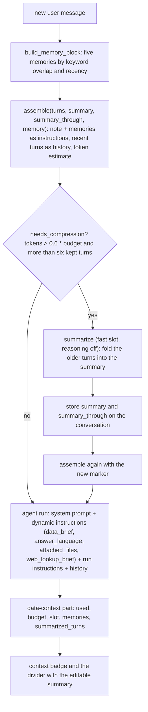

# 12: Elective, intelligent context management

**Claim:** The sheet asks for compression, isolation and selection. Compression is a rolling
summary that replaces turns older than the last six once a conversation passes 60 percent of
the slot's context, plus memory distillation that turns a turn into at most two durable facts.
Isolation is the profile: every table carries a profile foreign key, every tool call reads its
profile from the conversation, and SQL runs on a view already filtered to it. Selection is the
per-turn assembly: system prompt, dynamic instruction blocks about this profile, at most five
memories chosen by keyword overlap, the summary note, and the recent turns, counted by one
estimate the badge shows.

## How it works

In words, mapped to the sheet's three words:

**Isolation.**

1. A profile owns accounts, transactions, categories, rules, memories, conversations,
   changesets, imports, dashboard cards and the outbound log. Every REST
   read takes `profile_id`, every write carries it, and an id of another profile is a 404 rather
   than a silent no-op.
2. A chat turn's `ChatDeps.profile_id` comes from the conversation row, and every tool touches
   only what is on the deps. Generated SQL runs on a temp view already filtered to the profile,
   so no predicate the model could widen exists (06).
3. Conversations are also isolated from each other: only the summary and the memories cross,
   and a memory crosses only inside the profile (03).

**Selection.**

1. The system prompt is fixed. Four dynamic instruction blocks are rendered per run from the
   profile: what it holds right now (count, date range, accounts, taxonomy), the answer language
   (fixed in onboarding or detected from the newest message's function words), the attached files
   as a brief (bytes never enter the prompt), and whether web lookup is on.
2. Memories are selected per message, at most five, keyword overlap first and recency as the
   tie-break.
3. The history is the turns after the summary marker; the summary note stands in for the rest.
4. Sub-agents get their own compact context: the query sub-agent sees the profile facts and its
   request, never the conversation; the chart code pass sees the plan and a rows brief.

**Compression.**

1. One token estimate (four characters per token plus a per-message overhead) counts the system
   prompt, the instructions and the history. It is the number the badge shows, so the decision
   and the display agree.
2. When the estimate passes 60 percent of the budget (32768 by default, capped by the local
   `n_ctx`) and there is something older than the last six turns, those turns are folded into the
   summary by the fast slot with reasoning off, before the answer. The summary and the position
   it covers are stored on the conversation; nothing is deleted.
3. The transcript shows a divider where the summary took over; the summary is readable and
   editable, and the next turn sends the edited text.
4. Distillation compresses a turn into facts (03): a different axis of compression, across
   conversations rather than within one.

## The code path

1. Isolation: `src/finquery/db.py:Profile` and the `profile_id` column on `Conversation`,
   `Transaction`, `Memory`, `Changeset`, `DashboardChart`, `OutboundRequest`; `src/finquery/api/profiles.py:get_profile_or_404`;
   `src/finquery/agent.py:ChatDeps`; `src/finquery/query/guard.py:execute_read_only` (the
   temp view); `src/finquery/edits.py:find_transaction`.
2. Selection: `src/finquery/agent.py:data_brief`, `answer_language`, `attached_files`,
   `web_lookup_brief` (all `@chat_agent.instructions`); `src/finquery/onboarding.py:detect_language`,
   `language_rule`; `src/finquery/memory.py:select_memories`, `build_memory_block`;
   `src/finquery/query/subagent.py:load_query_context`, `profile_facts`;
   `src/finquery/chart/subagent.py:_rows_brief`.
3. Compression: `src/finquery/context.py:assemble`, `estimate_tokens`, `needs_compression`
   (`COMPRESS_ABOVE = 0.6`, `RECENT_TURNS = 6`), `turns_to_fold`, `summarize`
   (`summary_agent`, `SUMMARY_INSTRUCTIONS`, `MAX_SUMMARY_CHARS = 4000`), `context_budget`;
   `src/finquery/api/chat.py:_prompt_for` (assemble, decide, summarize, store, assemble again),
   `_store_summary`, `_context_stats`; `src/finquery/api/conversations.py:patch_conversation`
   (edit the summary, empty is 422); `src/finquery/memory.py:distill_memories`.
4. UI: `frontend/src/components/context-badge.tsx:ContextBadge`,
   `frontend/src/components/summary-divider.tsx:SummaryDivider`, the `data-context` part in
   `frontend/src/components/chat-view.tsx:latestContext`.
5. Tests: `tests/test_context.py` (compression at a small budget, the edited summary reaches the
   model, a card behind the divider is still answerable), `tests/test_memory.py`,
   `tests/test_profiles.py` (a profile's conversations, taxonomy and data stay its own),
   `tests/test_transactions.py` (a second profile lists nothing and cannot write another's row).

## Where the model is in the loop, and where it is not

- Model: writing the summary (fast slot, reasoning off); proposing distilled facts.
- Not the model: the token count, the threshold, which turns fold, where the divider goes,
  memory selection, the dynamic instruction blocks, the profile boundary, and what the summary
  may not do (it is a note above the conversation, never a fabricated system message).

## Guards and failure handling

- A failed summary never fails the turn: the conversation keeps sending its full history and
  tries again next turn.
- The summary travels as run-level instructions appended to the agent's system prompt; on the
  local provider the template folds both into one system message, so both providers see the same
  shape (ADR 0007).
- A resumed Question card turn reads the summary marker one turn short of the card and compresses
  nothing on that run, or the pending call would be summarized out of its own run (ADR 0008,
  ticket 29).
- The compressed prompt has a floor: system prompt plus summary plus six turns. The test budget
  had to move ten times as the prompt grew; the real budget is far above it.
- Nothing is deleted: turns stay in the database and in the transcript; only the prompt drops
  them.

## What we measured

| Figure | Value | Source |
| --- | --- | --- |
| Where compression starts | 60 percent of 32768, about 20k tokens, a quarter of an hour of local turns | `docs/demo-script.md`, ADR 0006 |
| Verified at `FINQUERY_CONTEXT_BUDGET=6000` | badge at 20.6 % (1.2K / 6K) after one turn; eight turns took it to 65.3 % and the eighth folded one turn; the divider appeared and the summary was editable; crossed three times in ticket 32 | tickets 12, 32 |
| System prompt size | 3919 tokens in the app's own estimator after ticket 42 (557 at ticket 12) | tickets 42, 12 |
| Floor a compressed prompt cannot go below | 4838 tokens; the test budget is 5700 for 18 percent headroom | ticket 42, `tests/test_context.py` |
| Estimate accuracy | four characters per token, within about fifteen percent for German and English prose, against a decision with a 40 percent margin | `context.py`, ADR 0007 |
| Summary cost | one fast-slot call with reasoning off on the turn that crosses; after that one turn folds per turn and the badge plateaus | ticket 12 |
| Isolation | a second profile lists nothing and its writes against another profile's rows change nothing; deleting a profile takes its conversations | tickets 04, 02 |
| Memory selection | five of two hundred | ticket 32 |

## Three sentences for the talk

1. "Isolation is the profile: every table carries it, every tool reads it from the conversation,
   and generated SQL runs on a view that is already filtered, so there is no predicate the model
   could widen."
2. "Selection is one function that builds each turn's prompt: the profile's facts as dynamic
   instructions, five memories chosen by keyword overlap, the summary note, the recent turns,
   and one token estimate that is also what the badge shows."
3. "Compression runs before the answer on the turn that crosses 60 percent: the turns older
   than the last six are folded into a rolling summary by the small model, the transcript shows a
   divider, and you can edit the summary yourself."

## Likely grader questions

- **Why an approximate token count?** The decision is made before the request is sent, so a
  provider-reported count cannot inform it, and showing a second number on the badge would
  disagree with the decision. The upgrade is a `tokenize` call on the local slot behind the same
  function (ADR 0007).
- **Why summarize before the turn and not after?** The turn that would cross the threshold is
  already the turn that runs small (ADR 0007).
- **Is the summary a system message?** No, run-level instructions appended to the agent's own
  prompt; a fabricated system message in the history would look different on the two providers.
- **How do you keep the prompt small for the sub-agents?** They never see the conversation. The
  chat agent writes a standalone request; the query sub-agent sees the profile facts and the
  request; the chart code pass sees the plan and a brief of the rows.
- **Is a library doing this?** No. `context.py` and `memory.py` are ours; Pydantic AI only passes
  `instructions` and `message_history` through.

## What is not finished

- Token counting is an estimate; no exact tokenizer path yet.
- No manual "compress now" action (not asked for).
- Dedupe of paraphrased or cross-language memories (03).
