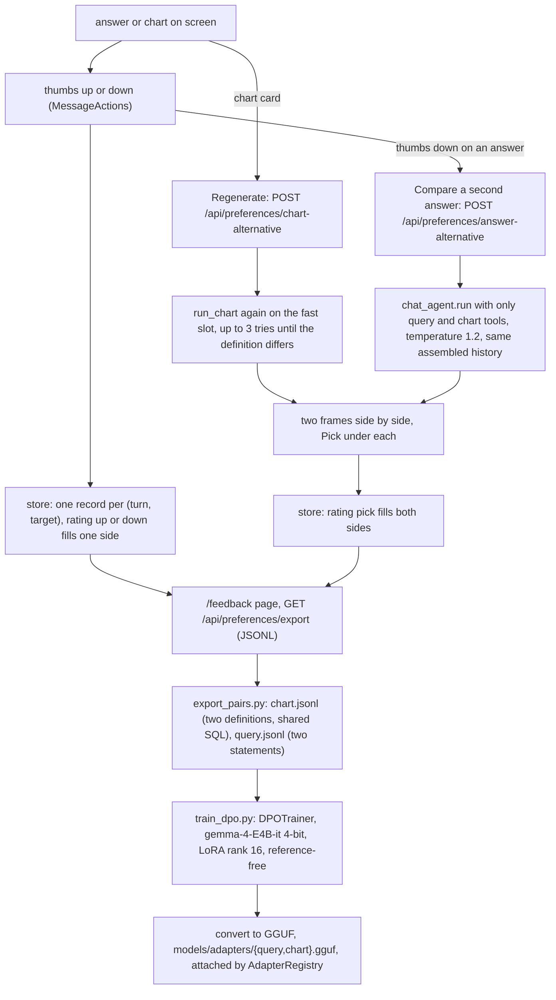

# 14: Elective, preference optimisation via human feedback

**Claim:** The user is presented with a choice of generated outputs and picks the preferred one:
Regenerate on a chart card draws the same request again and shows two charts side by side with
a Pick; a thumbs down on an answer offers a second answer at a higher temperature and a Pick.
Every thumb and every pick is a preference record (prompt, chosen, rejected, kind, rating, SQL
and chart code), listed on a Feedback page and exported as JSONL. `training/preference/` turns
the records with both sides into DPO datasets and trains a LoRA adapter on the fast slot's base
with TRL. Training itself has not been run.

## How it works

In words:

1. A thumb records one side: up fills `chosen`, down fills `rejected`. The prompt, the answer
   text, the tool outputs and a chart's plan, SQL and code are read server-side from the stored
   turn, so a record says what really happened. One row per turn and target; a second click
   replaces the first.
2. Regenerate draws the same request through the same `run_chart` on the fast slot, up to three
   times inside one press until the definition differs from the one on the turn. Both charts drew
   the rows of the same query; the user picks; the pick stores both definitions with the shared
   SQL.
3. A thumbs down on an answer offers a second answer: the same message answered again with the
   history assembled exactly as the turn was, only the read-only `query` and `chart` tools, and
   temperature 1.2. A turn that used a writing tool is refused (409), so nothing is applied twice
   and no card parks the rerun. The pick stores the pair.
4. The Feedback page lists kind, rating, prompt excerpt, date and slot and exports JSONL.
5. `export_pairs.py` keeps only records with both sides and writes `chart.jsonl` (prompt: request,
   plan and SQL; sides: two definitions) and `query.jsonl` (prompt: the question; sides: two
   statements from an answer A/B where both runs queried). `train_dpo.py --dry-run` validates a
   dataset without a GPU; `train` runs TRL's `DPOTrainer` on `google/gemma-4-E4B-it` in 4-bit
   with a rank 16 LoRA, the base weights as the reference. The adapter is converted to GGUF and
   dropped where the registry looks.

## The code path

1. `src/finquery/preferences.py:store` (the upsert), `read_turn` (`TurnContent`: prompt,
   answer, tools, charts, hints, `beyond_rerun`), `answer_side`, `chart_side`, `chart_prompt`,
   `list_records`, `export_jsonl`, `RERUN_TOOLS`.
2. `src/finquery/api/preferences.py:rate`, `store_pair`, `chart_alternative`
   (`ALTERNATIVE_ATTEMPTS = 3`), `answer_alternative` (`AB_TEMPERATURE = 1.2`,
   `chat_agent.override(tools=RERUN_TOOL_FUNCTIONS, toolsets=[])`), `get_preferences`,
   `export_preferences`.
3. `src/finquery/db.py:PreferenceRecord`: `turn_id`, `target` (a chart's tool call id or null
   for the answer), `kind`, `rating`, `prompt`, `chosen_json`, `rejected_json`, `model_slot`.
4. `src/finquery/api/chat.py:persist_turn` returns the turn id and puts it on the assistant
   message metadata, so the browser can rate the answer it just watched and the same id is there
   after a reload.
5. `frontend/src/components/feedback.tsx:Thumbs`, `useFeedback`, `useAnswerFeedback`,
   `PairSide`, `PairGrid`, `AnswerCompare`; `frontend/src/components/chart-tool.tsx:ChartToolStep`
   (thumbs, Regenerate, the pair); `frontend/src/components/feedback-page.tsx:FeedbackPage`.
6. `training/preference/export_pairs.py:chart_pairs`, `query_pairs`, `write`;
   `training/preference/train_dpo.py:load`, `train`, `main`;
   `training/preference/README.md`.
7. `src/finquery/local/adapters.py:AdapterRegistry`: where the trained adapter is attached (04).
8. Tests: `tests/test_preferences.py` (rating stored, pair stored with both sides, export shape,
   the A/B declares only the read-only tools at temperature 1.2, a chart turn's compare gives a
   second answer or a clean 409).

## Where the model is in the loop, and where it is not

- Model: the second chart, the second answer.
- Not the model: what a record contains (read from the stored turn), which side a click fills,
  the dedupe of identical charts, the refusal of a rerun that would write, the export, the
  dataset validation, the training configuration.

## Guards and failure handling

- Only the click comes from the browser; the sides are read server-side, except the second half
  of a pair, which was never a turn and is sent back by the client with the winner named.
- A rerun declares exactly `RERUN_TOOLS` and refuses a turn that used anything else; the frontend
  offers the button on the same allowlist. `lookup_merchant` stays out on purpose: a rerun would
  send a merchant token out because someone pressed a thumbs down (ticket 30, M2).
- Two identical chart definitions are nothing to pick between: the card says "Same chart again",
  and `export_pairs.py` drops equal pairs.
- Thumbs are hidden on an interrupted turn with nothing in it, and held back while a Question
  card is unanswered.
- A pair side whose frame fails to render loses its Pick.
- The dry run warns below 32 pairs, where DPO mostly measures noise.

## What we measured

| Figure | Value | Source |
| --- | --- | --- |
| Regenerate, local | 28 s for the second chart | `docs/demo-script.md` |
| Regenerate before the server-side retry | the review needed three presses of about 45 s each to get a different chart; now one press | tickets 15, 22 |
| Thumbs, Pick | instant, no model | `docs/demo-script.md` |
| A/B answer | a second answer at temperature 1.2 with only the read-only tools; a chart turn gives a second answer or a 409, never a 500 | ticket 30 |
| Export on a verification database | one query pair (the two A/B runs wrote different SQL), zero chart pairs (identical definitions) | ticket 15 |
| Test count | `tests/test_preferences.py` adds 8 at the HTTP seam | ticket 15 |

## Three sentences for the talk

1. "Feedback is a choice, not a survey: Regenerate draws the same chart request again and shows
   the two side by side with a Pick, and a thumbs down on an answer offers a second answer at a
   higher temperature to pick from."
2. "Every thumb and every pick is a preference record read from the stored turn, prompt, chosen,
   rejected, SQL and chart code, listed on the Feedback page and exported as JSONL."
3. "The training half is the DPO script on the fast slot's base with a LoRA adapter, the same
   base every sub-agent runs on, so a trained adapter slots straight into the registry; the
   script exists and validates a dataset, the run is the phase after the demo."

## Likely grader questions

- **Is this "a choice of generated texts"?** Yes, for charts (two definitions) and for answers
  (two texts). Both are the same request answered twice and a Pick.
- **Why DPO and not a reward model?** Pairs are exactly what DPO reads, one adapter per sub-agent,
  no reward model to train, and the base weights are the reference so it runs on one card.
- **Why train the sub-agents and not the chat model?** The sub-agents are what write the SQL and
  the charts, they run on E4B, and a pair from Regenerate is two chart definitions for one
  prompt, which is a sub-agent's output.
- **How much data do you have?** A handful of pairs from verification sessions. That is why the
  SFT generation of ticket 43 comes first and DPO on user picks is the continuous-improvement
  path.
- **Why does an A/B refuse a turn that imported a file?** Re-running a writing tool would apply
  it twice; the second answer may only read.

## What is not finished

- No training run; no adapter file; no evaluation of a trained adapter on the held-out third.
- The preference records on a demo database are too few for DPO (the dry run warns below 32).
- Ticket 43 (Opus-generated SFT data) has not started; DPO on picks comes after it.
