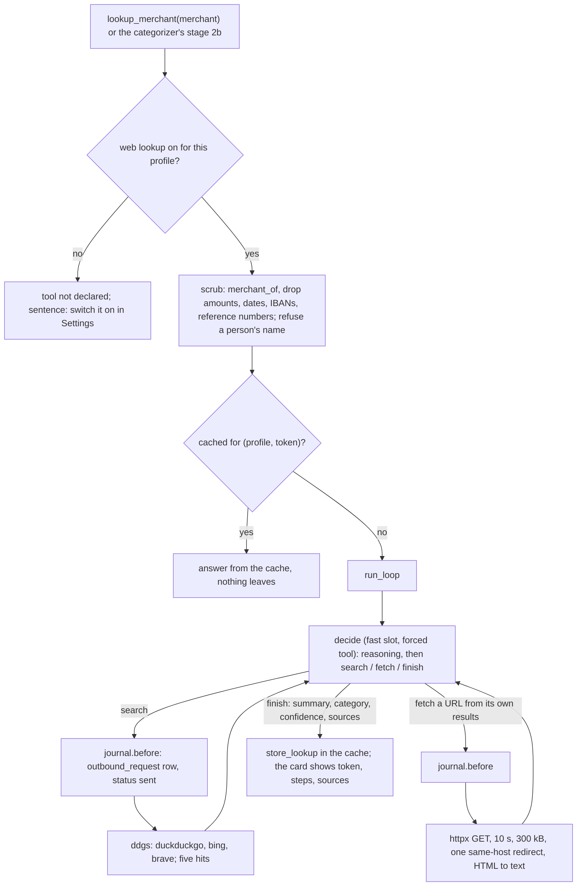

# 15: Elective, repeated self-controlled web search

**Claim:** When a profile switches web lookup on, the fast slot drives a loop of its own to find
out what an unknown merchant is: search, fetch and read one of the pages it found, or finish
with a summary, a category and a confidence, deciding itself how many steps it needs within a
budget of four searches and three page reads. Only a scrubbed merchant token ever leaves the
machine; every request is written to an outbound log before it is sent; a token leaves at most
once per profile because the result is cached; and the switch is off by default.

## How it works

In words:

1. The tool exists only for a profile with the switch on: `prepare` reads the switch per run, so
   flipping it off in Settings takes the tool away from the next turn. With it off the prompt says
   so and where to switch it on.
2. The merchant is scrubbed to a token: the merchant key the categorizer already derives, minus
   amounts, dates, IBANs, card, customer and reference numbers with the labels that introduce
   them, at most four words. A booking whose name reads as a person (two capitalized words, no
   legal form, no business word) is refused whole: no partial token, no request.
3. If this profile looked the token up before, the cached result is returned and the card says
   "from the lookup cache of this profile, nothing left the machine".
4. Otherwise the loop runs. One step is one fast-slot request with one forced tool: `search` with
   a query, `fetch` with a URL from its own results, or `finish` with a summary, a category, a
   subcategory, a confidence and the sources it relied on. Our code executes the step, appends
   the observation (hits, or the page text) and asks again. The budget is a ceiling the model is
   told about; it stops when it knows, which for a well-known merchant is after the first search.
5. Every request is a row in `outbound_request` written before the call and settled after. The
   Settings page lists the log. The query the model writes goes through the same scrub before it
   is sent, and a URL not in the model's own results is refused.
6. The result is a placement like any other: in the categorizer pipeline it feeds the same
   `Guess` shape between the dictionary and the model, so a merchant the lookup placed never
   reaches the model; on the chat agent the sources render under the answer.

## The code path

1. `src/finquery/agent.py:lookup_merchant` (with `prepare=_only_when_web_lookup_is_on`),
   `web_lookup_brief` (`WEB_LOOKUP_ON`, `WEB_LOOKUP_OFF`).
2. `src/finquery/weblookup/service.py:lookups_for` (the one place the switch is read; `None`
   when off), `Lookups` (`merchant`: scrub, cache, loop, keep).
3. `src/finquery/weblookup/scrub.py:scrub`, `looks_like_a_person`, `safe_query`,
   `BUSINESS_WORDS`, `MAX_TOKEN_WORDS = 4`.
4. `src/finquery/weblookup/loop.py:run_loop` (`MAX_SEARCHES = 4`, `MAX_FETCHES = 3`,
   `MAX_STEPS = 10`), `lookup_agent` (forced `decide`, `Decision` with `reasoning`, `action`,
   `query`, `url`, `summary`, `category`, `subcategory`, required `confidence`, `sources`),
   `lookup_prompt`, `refused` (a refused step carries the decision, the finding and what to send
   instead).
5. `src/finquery/weblookup/store.py:OutboundJournal` (`before` logs or raises `WebLookupOff`,
   `after` settles), `log_request`, `settle_request`, `cached_lookup`, `store_lookup`,
   `recent_log`, `web_lookup_enabled`.
6. `src/finquery/weblookup/client.py:HttpWebClient` (`ddgs` with `BACKENDS`
   `duckduckgo,bing,brave`, region de-de, `MAX_RESULTS = 5`, `SEARCH_TIMEOUT = 5`;
   fetch with `FETCH_TIMEOUT = 10.0`, `MAX_PAGE_BYTES = 300_000`, `html_to_text`),
   `WebClient` protocol, `SearchUnavailable`.
7. `src/finquery/categorize/pipeline.py:_look_up` (stage 2b, `LOOKUPS_PER_RUN = 5`, busiest
   merchants first).
8. `src/finquery/api/settings.py:get_settings`, `patch_settings` (`web_lookup_enabled`),
   `get_outbound_log`; `src/finquery/db.py:OutboundRequest`, `WebLookup`.
9. `frontend/src/components/lookup-tool.tsx:LookupToolStep` (token, steps, suggested category
   with confidence, summary, the AI Elements sources),
   `frontend/src/components/web-lookup-card.tsx:WebLookupCard` (the switch and the log).
10. Tests: `tests/test_web_lookup.py` with `StubWeb` and a `watch` hook that snapshots the log at
    the moment a request goes out (log before request), switch off means no call, cache hit makes
    no second request, the switch flipped off mid-loop stops at the journal; `tests/conftest.py`
    gives every other test a `NoWeb` client that fails if it is called at all.

## Where the model is in the loop, and where it is not

- Model: each step's decision (what to search, which page to read, when to stop), the summary,
  the suggested category and confidence.
- Not the model: whether the tool exists, the scrub, the person rule, the cache, the budget, the
  journal (before every request), the URL allowlist (its own results only), the search backends
  and timeouts, the page size cap, the HTML to text, the placement threshold, the sources
  rendering.

## Guards and failure handling

- Off by default, per profile. "Off" is the absence of the `Lookups` object, not a branch in
  every caller.
- The journal is the loop's only route to the outside world, so "written before it is sent" and
  "off means nothing leaves, even mid-lookup" are properties of the code (ticket 31 found three
  requests leaving after the switch was flipped, before the check moved into `before`).
- A lookup that reached no conclusion is not cached, so a rate limit never becomes a permanent
  wrong answer. When every search failed, the error names the backend rate limit rather than
  "spent its budget".
- `confidence` is the one required field of `decide`; a finish with 0 is handed back once, then
  taken as it is. A finish with a category and no summary is still a conclusion (the local fast
  model writes it that way); the summary then names the page relied on (ticket 17).
- A refused step carries the model's own decision and reasoning and the correction, not a bare
  line the model reads as a new question (ticket 42).
- The person rule errs towards refusing: "ROFU Kinderland" (two words, no business word) is not
  looked up. That costs a lookup and never a name.
- `lookup_merchant` is never rerun by the preference A/B, so a thumbs down cannot send a token
  out (ticket 30).

## What we measured

| Figure | Value | Source |
| --- | --- | --- |
| Typical searches per lookup | one; two when the first result set was thin (Nordsee: `nordsee was ist`, then `Nordsee restaurant Fischgeschaeft`) | ticket 14 |
| Confidences on three merchants in one turn | 1.0, 1.0, 0.9 (Decathlon, Rossmann, HelloFresh) | ticket 14 |
| The outbound log after a session | ten rows, every one a search whose target carries nothing but a merchant token | ticket 14 |
| As a categorizer stage | a small import: `by_dictionary 1, by_lookup 2, by_model 0, model_calls 0` (Douglas, Snipes placed by the lookup) | ticket 14 |
| Cache | asking about the same merchant in another conversation added no log entry | tickets 14, 22 |
| Demo, local | "What is dean&david on my statement?" 53 s, one search and one page read | `docs/demo-script.md` |
| Cost | two to three model calls per lookup, at most five lookups per import run | ADR 0010 |
| Switch off mid-loop, before ticket 31 | three more requests left the machine; after: the loop stops at the journal with a sentence | ticket 31 |

## Three sentences for the talk

1. "The model runs its own search loop: one call decides search, fetch or finish, our code
   executes it and appends what came back, and it stops when it knows, which for a well-known
   merchant is after one search; the budget is four searches and three page reads."
2. "It really reads pages, not only result snippets: a fetch may only go to a URL from its own
   results, ten seconds and three hundred kilobytes, turned to text and handed back."
3. "Only a scrubbed merchant token ever leaves, a person's name is refused outright, every
   request is logged before it is sent, and the Settings page shows that log, so 'nothing left my
   machine' is a table you can read and a test can assert, not a promise."

## Likely grader questions

- **Does it go further than the search results?** Yes: `fetch` reads a page and its text goes
  into the next decision; the sources the finish relied on render under the answer.
- **Is the number of searches fixed?** No. The model decides each step and is told what budget is
  left; the budget is a ceiling.
- **What can leave the machine?** The token (at most four informative words of the merchant key)
  and the model's query after the same scrub. Never amounts, dates, IBANs, reference numbers or
  a person's name. The test suite's default web client fails if any test reaches for the network.
- **Why is this not a library doing the elective?** `ddgs` is the keyless search call and
  `httpx` the fetch. The loop, the decision schema, the scrub, the journal, the cache and the
  categorizer stage are ours (ADR 0010).
- **What if DuckDuckGo rate limits?** The backend chain skips to Bing then Brave; if every search
  fails the lookup says so and caches nothing.

## What is not finished

- A lower-case person name in a booking text is not caught by the person rule; a list of given
  names is the noted upgrade path.
- Two-word companies with no business word in their name are refused (a lookup lost, never a
  name).
- The local fast model sometimes spends refused steps (a search with no query); they are logged
  as they came.
