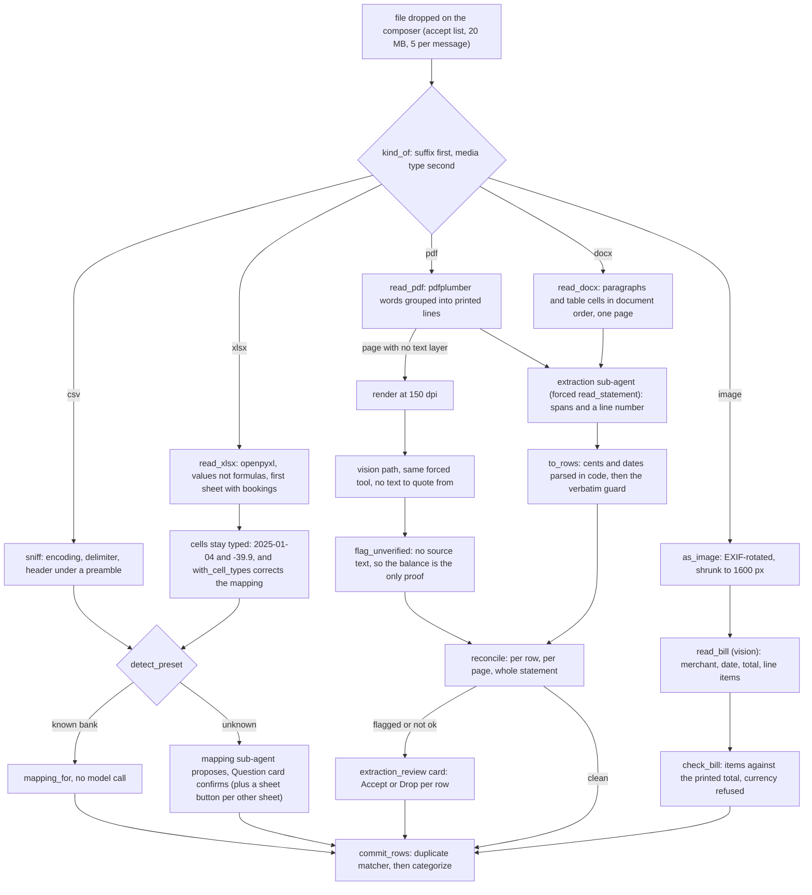

# 16: Elective, multimodal ingestion

**Claim:** Six kinds of file go into the same chat composer and come out as bookings in the same
table: a bank CSV, an Excel workbook, a statement PDF, a scanned PDF page, a Word document and a
photo of a receipt, plus the text a user types or pastes. Three of them are read by a model, and
that model is a vision-language model on both providers: every local model we ship is downloaded
with its own projector, and `finquery-check` asks each one on disk to name the colour of an
image. What a model returns is never a number: it points at the spans it read, the cents and the
dates are parsed in code, and two guards decide what may be written (ADR 0011). What a workbook
or a CSV holds is not read by a model at all, because a column can be parsed. Audio is out of
scope and refused with one sentence.

## How it works

In words:

1. The composer takes the five kinds by extension and media type and refuses everything else in
   this app's own words. The bytes are taken out of the message before the run starts and stored
   per conversation, so a 20 MB workbook costs the model nothing: it is told the file name, the
   kind and the size, and reads the file through `import_file`.
2. A **CSV** is sniffed (encoding, delimiter, the header row under any preamble) and an **XLSX**
   is read by openpyxl into exactly the same shape one sheet at a time. From there they are one
   path: the six bank presets, or a mapping the fast slot proposes and the user confirms on a
   Question card.
3. A workbook's cells keep what they already know. A date cell is a date and an amount cell is a
   number, so neither is parsed back out of a string with a guessed separator, and the mapping's
   own `date_format` and `decimal_separator` (a preset's, or the model's) are corrected for those
   columns before a single row is read. A workbook with bookings on more than one sheet puts one
   button per other sheet on the same mapping card, so which sheet and which columns are one
   question.
4. A **PDF** is read page by page from its text layer, and a page that has none is rendered at
   150 dpi and looked at. A **DOCX** has only text, so it is one page of the same text path:
   paragraphs and table cells in document order, a table row joined with the two spaces a printed
   column boundary becomes, so an amount stays on its booking's line.
5. The extraction sub-agent answers with spans (`date_text`, `amount_text`, `balance_text`) and a
   line number, never with numbers. The cents and the day are parsed from those spans in code.
6. The verbatim guard checks each span really occurs in the text of the page it was read from,
   whether that page came from a PDF or from a Word document. A rendered page and a photo have no
   text to check against, so their rows are flagged unverified and the arithmetic is the only
   proof there is. The reconciliation guard then walks the running balance per row, per page and
   over the whole statement.
7. A **photo** is a receipt: merchant, date, total and line items read by the vision path, the
   items held to the printed total, a foreign currency refused, and either a proposed split of
   the booking it matches or a preview card for a new one.
8. Typed or pasted **text** is the same idea without a file: one forced tool call per booking, a
   draft per row, a preview card, and the booking written from the stored draft rather than from
   figures the model retyped.
9. Every one of these ends in `commit_rows`, where a booking the profile may already have is held
   aside as a duplicate candidate instead of being inserted or dropped, and then in
   categorization. One commit, one duplicate rule, one summary counted in code.

## The code path

1. Composer and chips: `frontend/src/components/composer.tsx:ACCEPT` (the five kinds, no audio),
   `kindOf` (the word on the chip), `REJECTED` (the sentences a refused file gets);
   `frontend/src/components/imports-list.tsx:KIND_LABELS` (Excel workbook, Word document) on the
   Import page (ticket 24: that page imports nothing, it is the overview).
2. Storage and the brief: `src/finquery/api/attachments.py:take_uploads`, `store_uploads`,
   `chips`; `src/finquery/attachments.py:kind_of` (`csv`, `xlsx`, `pdf`, `docx`, `image`, else
   refused), `MAX_ATTACHMENT_BYTES`, `ACCEPTED_KINDS`, `brief`.
3. The router: `src/finquery/ingest/chat_import.py:import_attachment` sends `csv` and `xlsx` to
   `_import_csv`, `pdf` and `docx` to `_import_statement`, `image` to `_import_bill`;
   `mapping_card` builds the confirmation card and its sheet buttons.
4. Workbooks: `src/finquery/ingest/xlsx.py:read_xlsx` (openpyxl, `data_only=True`, sheets with a
   header and rows under it, a title block skipped by the same rule the CSV sniffer uses),
   `Workbook`, `with_cell_types` (what the cells correct about the mapping), `IGNORED` (charts,
   pictures and macros are not read).
5. Delimited files and the mapping both share: `src/finquery/ingest/csv_reader.py:sniff`,
   `detect_preset`, `mapping_for`, `parse`, `parse_amount`, `parse_date`;
   `src/finquery/ingest/mapping_agent.py:propose`.
6. Word documents: `src/finquery/extract/docx.py:read_docx` (paragraphs and table cells in
   document order, `CELL_GAP`), `DocxUnreadable`, `IGNORED`.
7. PDFs and photos: `src/finquery/extract/pdf.py:read_pdf`, `render`, `as_image`;
   `src/finquery/extract/layouts.py:detect_layout`.
8. One reader for both text paths: `src/finquery/extract/statement.py:extract_statement` (a
   `docx` is one page of text, a `pdf` is its pages, an `image` is one page to look at),
   `commit_extraction`; `src/finquery/extract/subagent.py:read_statement_text`,
   `read_statement_image`, `statement_prompt`.
9. Guards and review: `src/finquery/extract/guards.py:to_rows`, `occurs`, `date_occurs`,
   `reconcile`, `flag_unverified`; `src/finquery/extract/review.py:review_card`, `apply_review`.
10. Receipts: `src/finquery/extract/bill.py:read_bill_image`, `check_bill`, `bill_date`,
    `find_match`, `bill_outcome`.
11. Typed and pasted text: `src/finquery/agent.py:extract_transaction`, `add_transaction`;
    `src/finquery/ingest/typed.py:propose_transactions`, `store_drafts`, `preview_card`,
    `add_draft`.
12. The one commit: `src/finquery/ingest/commit.py:commit_rows`, `import_summary`;
    `src/finquery/ingest/duplicates.py:Matcher`.
13. The models that can see: `src/finquery/local/catalog.py:LOCAL_FAST`, `LOCAL_QWEN`,
    `LOCAL_GEMMA_12B` each carry a `projector` file (the mmproj), and
    `src/finquery/local/check.py:CheckName` includes `vision`, which is one of the four checks
    `finquery-check` runs per local model.
14. Fixtures and tests: `scripts/generate_synthetic.py:write_sparkasse_xlsx`,
    `write_statement_docx`; `fixtures/synthetic/sparkasse-2025.xlsx`,
    `fixtures/synthetic/statement-excerpt.docx`; `tests/test_xlsx_and_docx_import.py`,
    `tests/test_extraction.py`, `tests/test_chat_import.py`, `tests/test_edge_cases.py`.

## Where the model is in the loop, and where it is not

- Model: reading a printed page or a photo (spans and a line number, never a figure); a column
  mapping for a CSV or a workbook whose header no preset knows, once, confirmed by the user;
  grouping a receipt's items by category; reading a typed sentence into a draft; and deciding to
  call `import_file` at all.
- Not the model: which reader takes a file; the presets; the encoding, the delimiter and the
  header row; a workbook's sheets, its header row under a title block and the types of its cells;
  the parsing of every amount and date; both guards; the verdict sentence; the direction a
  balance chain contradicts; duplicate matching; the commit; every counted figure in the summary.
- Never a model: the bytes of a file in the prompt. The model gets a file name, a kind and a
  size, and calls a tool.

## Guards and failure handling

- **The verbatim guard applies to a DOCX exactly as to a PDF page**, because both are text: an
  amount the model rewrote (`-1150.00` for `-1.150,00`) is flagged even though its value is
  right, and the row goes to the review card.
- **A workbook cannot be misread by a separator**, which is the failure this half exists to
  prevent: a preset that says German decimal comma applied to the float `-39.9` would have
  written 3.990,00 EUR. A column that holds both numbers and text is left as the mapping
  describes it, because one format has to fit every cell of it.
- A sheet is only offered as a sheet if it has a header row with bookings under it, so a cover
  sheet with a title on it is not a choice the user has to make.
- An unreadable workbook and an unreadable Word file each answer with one sentence saying what to
  do next (save it as .xlsx or .docx, or attach the CSV export); the library's own words go to
  the log, the same treatment a damaged PDF got in ticket 31.
- Audio is refused at the door: it is not in the composer's accept list and `kind_of` answers
  `other`, so the message is refused before a turn starts with the sentence naming what may be
  attached.
- What a reader passes over is said rather than implied: a workbook's charts, pictures and macros
  and a Word document's pictures, headers and footers each come back as one line in the tool
  result for the answer to pass on.
- Everything the other ingestion paths already guard is unchanged: the size limit, five files per
  message, the duplicate matcher, the review card, the reconciliation verdict recomputed on the
  server over exactly the rows committed.

## What we measured

| Figure | Value | Source |
| --- | --- | --- |
| Statement PDF, 15 pages, OpenRouter | 433 of 433 bookings, 0 flagged, reconciled (4.210,55 + 5.699,01 = 9.909,56), 131 s | ticket 11 |
| Same PDF, local fast slot (Gemma 4 E4B) | 433 of 433, 0 flagged, reconciled, 1458 s (about 97 s a page) | ticket 17, `docs/demo-script.md` |
| Scanned page read as an image | 22 s, 28 bookings; an earlier run read 12 and the balance chain caught it with a 500,86 EUR difference | ticket 11 |
| Twenty public receipts, before to after ticket 42 | total read 19/19; items add up 15 to 16 of 20; date right 20 to 19 of 20; a euro receipt wrongly refused as foreign 1 to 0 | ticket 42 |
| Bill photo split, local | 100 s; seven items summing to 20,73 EUR matched to the EDEKA booking of 14.03.2025 | `docs/demo-script.md` |
| XLSX, the shipped workbook | 433 of 433 bookings, no model call (the Sparkasse header is a preset), every amount and date read off the cells: the year sums to 5.699,01 EUR, the same as the CSV and the PDF of it | ticket 58, `tests/test_xlsx_and_docx_import.py` |
| DOCX, the shipped excerpt | 15 of 15 bookings from one page of text, 0 flagged, reconciled 4.210,55 to 2.332,58 | ticket 58 |
| DOCX with one amount rewritten by the reader | 1 flagged, nothing imported until the card was answered | ticket 58 |
| The two new fixtures | 25 KB and 37 KB, byte for byte reproducible (`uv run python scripts/generate_synthetic.py`) | ticket 58 |
| Attachment kinds refused | audio, archives and anything else: one sentence, no turn started | `tests/test_edge_cases.py`, `tests/test_chat_import.py` |
| CSV edge cases fixed with tests | duplicate header names, ragged rows kept as issues, `(4,90)` as money out, `0,00` in the unused money column, control characters dropped | ticket 31 |
| 10.000 row CSV | imports; a second import is 10.000 candidates in 3,5 s | ticket 31 |
| Local models that can see | Gemma 4 E4B and Qwen3.5 9B answered the `vision` check (all eight checks green); Gemma 4 12B ships the same kind of projector and is covered by the same command | ticket 23, ticket 54 |

## Three sentences for the talk

1. "Six kinds of file go into the same box and come out as rows in the same table: a CSV, an
   Excel workbook, a statement PDF, a scanned page, a Word document and a photo of a receipt, and
   they all end in one commit that never inserts a booking you may already have."
2. "Where a column can be parsed we parse it, and a workbook makes that sharper: a cell already
   knows it is a date or a number, so we keep that and correct the mapping instead of guessing a
   decimal separator. Only a printed page needs a model, and there the model is not allowed to
   return a number: it points at the printed span, we parse the cents, and we check the span is
   really on that page."
3. "The Word document proves the guards are about the text and not about the file format: the
   same extraction sub-agent, the same verbatim check, the same balance chain, and a rewritten
   amount is flagged on a card before anything is written."

## Likely grader questions

- **Is a vision-language model really used?** Yes, for the two paths that need eyes: a PDF page
  with no text layer and a photo. Every local model we ship is a VLM (Gemma 4 E4B on the fast
  slot, Qwen3.5 9B and Gemma 4 12B in the chat seat), each downloaded with its own projector, and
  `finquery-check` asks each one on disk what colour an image is before a demo starts.
- **Why is a CSV or an XLSX not read by the model?** Because a column is data, not a picture, and
  a model reading 433 rows would be slower, dearer and less right than `parse`. The model is used
  where it is needed: naming which column is the amount, once, for a bank we do not know.
- **Is a library doing the elective?** openpyxl and python-docx turn bytes into cells and
  paragraphs, the way pdfplumber turns a PDF into words. What the elective is about is what
  happens after that: the preset detection, the cell types correcting the mapping, the spans, the
  two guards, the review card and the one commit, all of which are ours.
- **What about audio?** Out of scope, and refused rather than half-handled. Bank statements do
  not arrive as audio, and a transcription path would have no guard: there is no printed page to
  hold a figure to.
- **What happens with a workbook of several sheets?** The first sheet with bookings under a header
  is read, and the mapping card carries a button per other sheet, so switching costs one click and
  re-asks the columns for that sheet.
- **Does a Word document reconcile?** When it prints balances, yes: the excerpt fixture opens at
  4.210,55 EUR and closes at 2.332,58 EUR, and the guard walks its 15 rows. A document with no
  balances is `not_checkable` and the user decides on the card, exactly as for a PDF.

## What is not finished

- Audio, and no plan for it.
- `.xls` (the pre-2007 binary format) and `.doc` are not read; both refusals name the format and
  ask for a re-save.
- A DOCX is one page, so a flagged row points at a line number in the whole document rather than
  at a printed page. Nothing downstream needs more, but a very long document makes for a long
  single prompt (the page ceiling is `SUBAGENT_MAX_TOKENS` per call, not per page count).
- Images inside a Word document are not looked at, only its text. A statement pasted into Word as
  a screenshot is a file the vision path could read, and it does not reach it today.
- A workbook with a preset header and several sheets imports the first one without asking: the
  sheet picker lives on the mapping card, and a recognized bank never shows that card.
- The REST endpoints (`POST /api/imports/preview` and `POST /api/imports/extract`) still take CSV,
  PDF and images only. No screen calls them for a workbook or a Word file; the chat is the import
  path (ticket 24).
